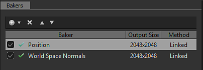
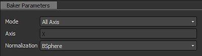

# Bakers 레거시 인터페이스

다음은 6.0.4 이전의 [Adobe Substance 3D Designer](https://www.adobe.com/kr/products/substance3d-designer.html) 버전에서 사용할 수 있는 베이커 인터페이스에 대한 설명입니다.

## 개요

베이커 패널은 4부분으로 나누어져 있습니다:

### 1: 장면

베이킹 프로세스에 관여하는 메쉬의 부분을 정의할 수 있습니다.

버전 6의 새로운 기능, 재료 별로 선택할 수도 있습니다.

### 제빵사

 단추를 눌러 원하는 베이커를 처리 목록에 추가할 수 있습니다

>[!NOTE]
>
> 베이킹은 목록 순서(위에서 아래로)에 따라 처리됩니다. 다른 베이킹 프로세스에서 노멀 맵과 같은 베이킹 결과를 재사용하려면 이 과정이 중요할 수 있습니다

베이커 레이아웃에서 &quot;+&quot;를 클릭하면 스택에 베이커를 추가할 수 있습니다(원하는 수의 베이커를 스택에 배치할 수 있습니다).

.

을 눌러 목록에서 굽기 프로세스를 제거할 수 있습니다

베이킹 프로세스를 선택하고 을(를) 사용하여 베이킹 프로세스 목록의 순서를 바꿀 수 있습니다

### 3: 베이커 매개 변수

이 섹션에는 현재 선택한 제빵사의 특정 옵션이 표시됩니다.

### 4: 공통 매개변수

제빵사 간에 공유되는 매개 변수를 표시합니다.

>[!NOTE]
>
> 기본적으로 이러한 매개 변수 중 하나를 변경하면 모든 베이커에 영향을 미칩니다. 단, [매개 변수 재정의]를 선택하는 경우에는 모든 베이커에 공통적으로 적용됩니다. 이 경우에는 변경 내용이 현재 베이커에 대해 로컬로 적용됩니다.

* 필요한 경우 **리소스 이름** 필드를 사용하여 생성된 비트맵의 이름을 변경할 수 있습니다.
* **파일 형식** 드롭다운 목록을 사용하여 기본 파일 형식(Windows 또는 OS/2 비트맵 형식, &quot;BMP&quot;)을 변경할 수 있습니다.
* **메쉬 특정 폴더에**&#x200B;리소스 배치&#x200B;**확인란을 사용하면 생성된 비트맵을 모델과 동일한 레벨에 저장할지 또는 &quot;Resources&quot;라는 이름의 새 하위 폴더에 저장할지 선택할 수 있습니다.**
* **메서드**&#x200B;를 사용하면 새 비트맵 리소스를 Substance 패키지에 연결할지 또는 포함시킬지 여부를 정의할 수 있습니다.
* **폴더**&#x200B;를 사용하면 맵을 저장할 위치를 정의할 수 있습니다.

베이커 창의 오른쪽 하단에 있는 확인 버튼을 누르면 베이킹 과정이 시작됩니다.

버전 6의 새로운 기능: 이제 취소 버튼을 사용하여 베이킹 프로세스를 취소할 수 있습니다.

