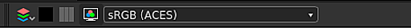

# 색상 관리

이 페이지에서는 Substance 3D Designer의 색상 관리 기능 및 설정에 대해 설명합니다.

색상 관리에 [OpenColorIO](https://opencolorio.org/)&#x200B;(OCIO) 또는 Adobe Color Engine(ACE)를 사용하도록 Substance 3D Designer을 구성할 수 있습니다. 이를 통해 여러 응용 프로그램에서 *일관성 있는* 색상 변환과 이미지 표시를 할 수 있습니다.

이 모드에서 Designer은 내부적으로 **선형 RGB** 색상으로 작동합니다. 일반적으로 8비트 심도는 선형 색상을 나타내기에 충분하지 않으므로 [그래프](../compositing-graphs/substance-compositing-graphs.md)의 색상 텍스처에 *최소* **16비트** 깊이를 사용하는 것이 좋습니다.

>[!WARNING]
>
> 효과적인 색상 관리 워크플로우는 올바르게 *보정* 디스플레이를 사용하여 작업해야 하며, 특수 하드웨어를 사용하여 작업 환경에 맞게 모니터를 올바르게 보정하기 위한 타사 솔루션이 있습니다.
> 
> OpenColorIO 사용자는 모니터에 일치하는 OpenColorIO 색상 공간을 사용해야 합니다.\
> Adobe ACE 사용자는 *OS*&#x200B;에서 선택한 ICC 프로필이 *해당* 모니터와 일치하는지 확인해야 합니다.

## 구성

색상 관리 설정은 [환경 설정](../interface/preferences-window/preferences-window.md) 대화 상자의 [프로젝트](../interface/preferences-window/project-settings/project-settings.md) 탭에서 구성할 수 있습니다. 다음 설정을 지정할 수 있습니다.

### 색상 관리 모드

|  |  |
| --- | --- |
| <b>색상 관리</b> | 이 설정을 사용하면 Substance 3D Designer에서 색상 관리를 위한 [레거시](../color-management/color-management.md), [OpenColorIO](#opencolorio) 또는 [Adobe ACE](#adobe-ace) 모드를 선택할 수 있습니다. *기본값: 레거시* |

## OpenColorIO

### OpenColorIO 구성

색상 관리에 OpenColorIO 모드를 사용하는 경우 Designer은 <b>구성 파일</b>(*\*.config*)에 저장된 정보를 사용하여 색상 변환을 수행하고 색상 공간을 식별하며 기본값을 설정합니다.

Substance 3D Designer은 다음과 같은 구성으로 제공됩니다.

* Substance: 공통 색상 공간을 포함하는 간단한 구성
* [ACES 1.0.3](https://github.com/hpd/OpenColorIO-Configs/tree/master/aces_1.0.3): 모든 기능을 갖춘 [Academy Color Encoding System](https://www.oscars.org/science-technology/sci-tech-projects/aces)&#x200B;(ACES) 구성, 색상 관리 워크플로에 대한 업계 표준

이러한 구성 파일은 Designer 설치 파일의 <b>리소스 > ocio</b> 폴더에서 찾을 수 있습니다.

|  |  |
| --- | --- |
| <b>OpenColorIO 구성</b> | 이 설정을 사용하면 Designer 전체에서 사용할 OpenColorIO 구성 파일을 선택할 수 있습니다. 또는 OCIO 환경 변수를 사용하여 OpenColorIO 구성 파일을 설정할 수 있습니다.  구성 파일이 있으면 Designer에서 *잠김*&#x200B;됩니다. 기본 색상 공간을 변경하고 변형을 표시할 수도 있습니다(아래 설정 참조).  **경고:** 환경 변수를 추가한 후에는 Designer을 닫고 OS의 사용자 세션에서 *로그아웃*&#x200B;한 다음 다시 로그인하는 것이 좋습니다. 이렇게 하면 Designer을 시작할 때 환경 변수가 적용됩니다. 명령줄을 사용하여 임시 환경 변수를 만들고 *동일* 명령줄 환경에서 Designer을 시작할 수도 있습니다.  *기본값: Substance* |
| **사용자 지정 구성 파일** | **OpenColorIO 구성**&#x200B;에 **사용자 지정** 옵션이 설정된 경우 이 필드에서 구성 파일로 사용할 *특정 \*.config 파일&#x200B;*을 선택할 수 있습니다.*&#x200B;기본값: OpenColorIO 구성 파일 또는 OCIO 환경 변수에 의해 설정* |

### 비트맵 색상 공간 기본값

|  |  |
| --- | --- |
| <b>8비트 이미지</b> | 8비트 비트맵의 기본 색상 공간을 설정합니다. *기본값: OpenColorIO 구성 파일에 의해 설정* |
| <b>16비트 이미지</b> | 16비트 비트맵의 기본 색상 공간을 설정합니다. *기본값: OpenColorIO 구성 파일에 의해 설정* |
| <b>부동 소수점 이미지</b> | *\*.exr *또는*\*.hdr* 형식의 *HDR* 이미지와 같은 부동 소수점 정밀도 비트맵의 기본 색상 공간을 설정합니다. *기본값: OpenColorIO 구성 파일에 의해 설정* |
| <b>파일 이름을 사용하여 색상 공간 검색</b> | 비트맵 파일 이름 *의*&#x200B;접미사&#x200B;*가 현재 OpenColorIO*&#x200B;구성&#x200B;*에 포함된 색상 공간의 소문자 이름과 정확히*&#x200B;일치하는 경우 Designer에서 자동으로 색상 공간을 할당할 수 있도록 합니다. 예: 비트맵 리소스 *mybitmap\_aces\_acescg.png*&#x200B;이(가) 자동으로 *ACES - ACEScg* 색상 공간으로 설정되고 적절한 변환이 작업 색상 공간에 적용됩니다. *기본값: 선택됨* |

### 2D 및 3D 보기 표시 기본값

|  |  |
| --- | --- |
| <b>2D 및 3D 보기 표시 기본값</b> | [2D 보기](../interface/2d-view/2d-view.md) 및 [3D 보기](../interface/3d-view/3d-view.md) 뷰포트에 대한 기본 *표시* 색상 공간을 설정합니다. *기본값: OpenColor IO 구성 파일로 설정* |
| <b>축소판 색상 관리</b> | Designer이 그래프에서 노드 *축소판*&#x200B;을(를) *작업* 색상 공간으로 자동으로 변환할 수 있도록 합니다. *기본값: 선택됨* |

## Adobe ACE

### 색상 설정

색상 관리에 Adobe ACE 모드를 사용할 때 Substance 3D Designer에서는 <b>ICC 프로필</b>(*\*.icc / \*.icm*)에 저장된 정보를 사용하여 색상 변환을 수행하고 색상 공간을 식별합니다.

Designer은 다양한 ICC 프로필과 함께 제공됩니다. Designer 설치 파일의 `resources > icc` 폴더에서 이러한 프로필에 대한 파일을 찾을 수 있습니다.\
현재 시스템 사용자의 *문서* 폴더에 있는 `Adobe/Adobe Substance 3D Designer/icc` 위치에 이러한 파일을 배치하여 *자신의* ICC 프로필을 추가할 수 있습니다.

|  |  |
| --- | --- |
| <b>작업 영역</b> | 이 설정을 사용하면 작업 색상 공간을 선택하여 Substance 3D Designer 전체에서 *색상 작업을 수행*&#x200B;할 수 있습니다. *기본값: sRGB IEC61966-2.1* |
| <b>렌더링 의도</b> | 이 옵션을 사용하면 색상이 *작업*&#x200B;색상 공간의 *색상 영역 외*&#x200B;인 경우 색상을 변환하는 방법을 제어할 수 있습니다. *기본값: 상대 색도계* |

### 비트맵 색상 공간 기본값

|  |  |
| --- | --- |
| <b>8비트 이미지</b> | 8비트 비트맵에 사용할 기본 ICC 프로필을 설정합니다. *기본값:* sRGB IEC61966-2.1 ** |
| <b>16비트 이미지</b> | 16비트 비트맵을 사용하도록 기본 ICC 프로필을 설정합니다. **기본값: *sRGB IEC61966-2.1*** |
| <b>부동 소수점 이미지</b> | *\*.exr *또는*\*.hdr* 형식의 *HDR* 이미지와 같이 부동 소수점 정밀도 비트맵에 사용할 기본 ICC 프로필을 설정합니다. *기본값: Raw(즉, 프로필이 적용되지 않음)* |
| <b>사용 가능한 경우 포함된 ICC 프로필 사용</b> | Designer에서 위에 나열된 기본값 대신 비트맵에 임베드된 ICC 프로필을 사용할 수 있도록 합니다. *기본값: 선택됨* |

### 2D 및 3D 보기 표시 기본 공간

|  |  |
| --- | --- |
| <b>2D 및 3D 보기 표시 기본값</b> | [2D 보기](../interface/2d-view/2d-view.md) 및 [3D 보기](../interface/3d-view/3d-view.md) 뷰포트에 대한 기본 *표시* 색상 공간을 설정합니다. *기본값:***&#x200B;기본 화면에 대한 ICC 프로필, OS에서 검색됨&#x200B;**&#x200B;** |

### 그래프 표시

|  |  |
| --- | --- |
| <b>축소판 색상 관리</b> | *선택*&#x200B;되면 Designer은 *노드 축소판*&#x200B;을 현재 *작업 색상 공간*(으)로 변환합니다. *기본값:***&#x200B;선택 취소됨&#x200B;**&#x200B;** |

## 레거시 모드

Designer에서 <b>레거시</b> 모드를 사용하는 경우 색상 관리가 *비활성화*&#x200B;됩니다.

이 모드에서 그래프와 이미지는 이전 버전과 정확히 동일하게 작동합니다. 즉, 이 설정을 *그대로* 유지하면 이전 버전의 워크플로가 *영향을 전혀 받지 않음*&#x200B;됩니다. 그러나 몇 가지 유용한 추가 사항이 있습니다.

<b>ACES sRGB</b>를 사용하도록 선택할 수 있습니다. *[Unreal 엔진](https://docs.unrealengine.com/en-US/Engine/Rendering/PostProcessEffects/ColorGrading/index.html)*&#x200B;과 같은 다른 소프트웨어의 출력과 일치하도록 <b>3D 보기</b>의 *tonemapping*.

이 페이지의 [출력 내보내기](#exporting-outputs) 섹션에 설명된 대로 *내보낸 비트맵*&#x200B;에 대한 색상 공간을 설정할 수 있습니다. 사용 가능한 색상 공간은 다음과 같습니다.

* sRGB
* 선형
* 원본

레거시 모드에서 Designer은 대부분의 디스플레이에서 재생할 수 있는 <b>sRGB 작업 색상 공간</b>을 사용합니다.

&#39;Raw&#39; 옵션을 고려할 때 그래프에서 이미지 데이터 *있는 그대로*&#x200B;를 씁니다(즉, 그래프 작업 색상 공간 사용). 이는 <b>Raw</b> 및 <b>sRGB</b> 옵션을 통해 *동일한 색상 출력*&#x200B;이 발생함을 의미합니다.

기본적으로 &#39;sRGB&#39; 옵션은 *색상 정보*&#x200B;를 포함하는 출력(예: 기본 색상, 발광)에 대해 설정되고 &#39;Raw&#39; 옵션은 *순수 데이터*&#x200B;를 포함하는 출력(예: 거칠기, 금속, Height, 표준)에 대해 설정됩니다. 위에서 설명한 대로 이러한 기본값은 효과적으로 같은 색상이 되며 *최종 사용을 구분*&#x200B;하는 경우에만 설정됩니다.

<b>선형</b> 옵션은 이미지에 *색상 변환*&#x200B;이 적용되는 *전용*&#x200B;이며, 선형 색상 공간에서 일반적으로 *부동 소수점 정밀도*(예: 16F 또는 32F 비트 심도)를 사용하는 <b>High Dynamic Range</b>(HDR) 이미지에만 사용할 수 있습니다. 이를 통해 이러한 이미지를 다양한 색상 공간 및 프로덕션 환경에서 사용할 수 있습니다.

>[!NOTE]
>
> 이미지 내보내기에 대한 자세한 내용은 설명서의 [비트맵 내보내기](../compositing-graphs/exporting-bitmaps/exporting-bitmaps.md) 페이지를 참조하십시오.

## 비트맵 가져오기

가져온 비트맵과 연결된 비트맵에 <b>색상 공간</b>(OCIO) 또는 <b>ICC 프로필</b>(Adobe ACE)을 할당할 수 있습니다.

비트맵을 가져오거나 연결할 때 [프로젝트 설정](../interface/preferences-window/project-settings/project-settings.md)의 <b>색상 관리</b> 탭에 있는 <b>비트맵 색상 공간 기본값</b> 섹션에 설정된 옵션을 사용하여 색상 공간 또는 ICC 프로필이 비트맵 리소스에 대해 *기본적으로* 설정됩니다.

비트맵 리소스의 <b>속성</b>에 있는 옵션은 언제든지 비트맵의 색상 공간을 변경할 수 있습니다.

>[!NOTE]
>
> **OpenColorIO만**
> 
> 특히 **파일 이름**&#x200B;을 사용하여 적절한 색상 공간을 *자동으로* 설정할 수 있습니다. 파일 이름의 색상 공간 이름은 OpenColorIO 구성 파일의 *이름*&#x200B;과 일치해야 합니다(예: *myImage\_utility - linear -srgb.png*&#x200B;는 *유틸리티 - Linear - sRGB* 색상 공간으로 설정됩니다).

## 출력 내보내기

<b>출력 내보내기</b> 대화 상자를 사용하는 경우 *각* 출력에 대해 <b>색상 공간</b>(OCIO)을 할당하거나 <b>ICC 프로필</b>(Adobe ACE)을 연결할 수 있습니다.\
Designer은 이미지 파일을 저장하기 전에 이미지를 지정된 색상 공간으로 *변환*&#x200B;합니다.

{width="512px"}

[2D 보기](https://helpx.adobe.com/kr/substance-3d/unlisted/documentation/sddoc/2d-view-deprecated-129368155.html)에서 *저장됨* 이미지에 색상 공간(OCIO)을 할당하거나 ICC 프로필(Adobe ACE)을 연결할 수도 있습니다.

## 2D 및 3D 보기

### 도구 모음 표시

색상 관리를 *전환*&#x200B;하고 표시 도구 모음의 드롭다운 메뉴를 사용하여 언제든지 보기에 대한 *표시 변형*&#x200B;을 변경할 수 있습니다.

{width="512px"}

### 라이브러리 HDRI 환경

Designer과 함께 제공되는 HDRI 환경은 <b>선형 sRGB</b> 색상 공간에 있습니다.\
[ACES](https://acescentral.com/t/getting-started-with-aces/1372) 구성과 같이 장면 선형 색상 공간이 *아님* 선형 sRGB인 OpenColorIO 구성을 사용하는 경우 환경에 *잘못된 색상*&#x200B;이 표시됩니다.

이 경우 3D 보기 패널 <b>환경</b> 메뉴에서 사용할 수 있는 환경 속성에서 라이브러리 HDRI 환경의 색상 공간을 *수동으로* 설정해야 합니다.

{width="512px"}

## 색상 변환 노드

[라이브러리](../interface/the-library/the-library.md)에는 ACEScg 색상 공간에서 <b>변환</b>을 수행하기 위한 다음 노드가 포함되어 있습니다.

<table>
<tr style="border: 0;">
<td style="border: 0;" valign="top">

[Substance 그래프](../compositing-graphs/substance-compositing-graphs.md)

* ACEScg에서 Linear sRGB로
* 선형 sRGB에서 ACEScg로
* ACEScg ~ sRGB
* sRGB에서 ACEScg로

</td>
<td style="border: 0;" valign="top">

[Substance 함수 그래프](../function-graphs/function-graphs.md)

* ACEScg에서 Linear sRGB로
* 선형 sRGB에서 ACEScg로

</td>
</tr>
</table>

이는 색상 관리나 [Substance 3D 에셋](https://helpx.adobe.com/kr/substance-3d/unlisted/assets.html) 라이브러리에서 *만든* 그래프를 사용하여 작업할 때 유용합니다.

{width="512px"}

## 알려진 제한 사항

현재 Substance 3D Designer에서 색상 관리를 구현하는 데는 다음과 같은 제한 사항이 있습니다.

* 색상 관리가 현재 [Python API](../scripting/scripting.md)에서 *표시되지 않음*;
* [OpenColorIO](https://opencolorio.org/) *룩*&#x200B;은 *지원되지 않습니다*.
