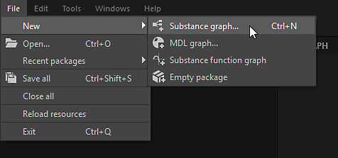

# Substance 그래프 만들기

Designer에서 텍스처 작성은 사전 제작된 템플릿 또는 빈 그래프에서 Substance 그래프를 만드는 것으로 시작됩니다.

## 그래프 만들기

새 [Substance 그래프](../../compositing-graphs/substance-compositing-graphs.md)를 만드는 프로세스를 시작하려면 다음 방법 중 하나를 사용할 수 있습니다.

* &#x200B;
  <table>
  <tr style="border: 0;">
  <td style="border: 0;" valign="top">

  홈 화면에서 <b>새 그래프</b> 단추를 클릭합니다.

  </td>
  <td style="border: 0;" valign="top">

  {zoomable="yes"}

  </td>
  </tr>
  </table>

* &#x200B;
  <table>
  <tr style="border: 0;">
  <td style="border: 0;" valign="top">

  [탐색기](https://helpx.adobe.com/substance-3d/unlisted/documentation/sddoc/the-explorer-129368147.html)의 *기존* 패키지 항목에서 <b>RMB</b>를 클릭하고 상황에 맞는 메뉴에서 <b>새로 만들기 > Substance 그래프</b>로 이동합니다.

  </td>
  <td style="border: 0;" valign="top">

  {zoomable="yes"}

  </td>
  </tr>
  </table>

* &#x200B;
  <table>
  <tr style="border: 0;">
  <td style="border: 0;" valign="top">

  기본 도구 모음에서  <b>새 Substance 그래프</b> 단추를 클릭합니다.

  </td>
  <td style="border: 0;" valign="top">

  {zoomable="yes"}

  </td>
  </tr>
  </table>

* &#x200B;
  <table>
  <tr style="border: 0;">
  <td style="border: 0;" valign="top">

  [기본 메뉴](https://helpx.adobe.com/substance-3d/unlisted/documentation/sddoc/the-main-menu-143720673.html)에서 <b>파일 > 새로 만들기 > Substance 그래프...</b>로 이동합니다.

  </td>
  <td style="border: 0;" valign="top">

  

  </td>
  </tr>
  </table>

* <b>Ctrl+N</b>(Windows)/<b>Cmd+N</b>(macOS) 키 입력을 누릅니다.

어떤 방법을 선택하든 <b>새 Substance 그래프</b> 대화 상자가 표시됩니다.

## 그래프 템플릿

새 Substance 그래프를 만드는 데 사용된 방법에 관계없이 항상 새 그래프를 구성할 수 있는 <b>새 Substance 그래프</b> 대화 상자가 표시됩니다.

{zoomable="yes"}

### 템플릿

Designer에는 더 빠르게 시작할 수 있도록 사전 구성된 노드가 있는 그래프 템플릿이 포함되어 있습니다. 여기에는 [출력](../../compositing-graphs/nodes-reference-for-com/atomic-nodes/output/output.md) 노드, 이러한 출력으로 값을 전달하는 간단한 노드(예: [균일한 색상](../../compositing-graphs/nodes-reference-for-com/atomic-nodes/uniform-color/uniform-color.md) 및 [입력](../../compositing-graphs/nodes-reference-for-com/atomic-nodes/input/input.md) 노드)가 포함될 수 있습니다.

목록에서 템플릿을 두 번 클릭하거나 템플릿을 선택하고 <b>만들기</b> 단추를 클릭하여 해당 템플릿을 사용하여 새 Substance 그래프를 만듭니다. 기본적으로 새 그래프는 저장되지 않은 새 패키지에 배치됩니다.

>[!TIP]
>
> 처음부터 시작
> 
> 완전히 비어 있는 그래프에서 시작하려면 &#39;비어 있음&#39; 범주에서 <b>비어 있음</b> 템플릿을 선택하십시오.

>[!NOTE]
>
> 템플릿 전환
> 
> 잘못된 템플릿을 선택하면 그래프를 만든 후 다른 템플릿으로 전환할 수 *없습니다*.
> 
> 기존 그래프를 다른 템플릿에 연결하려면 적절한 템플릿을 사용하여 새 그래프를 만들고 새 그래프에 그래프를 복사하여 붙여넣을 수 있습니다. 필요에 따라 노드를 다시 연결합니다. 특히 출력 노드입니다.

<table>
<tr style="border: 0;">
<td width="100.00%" style="border: 0;" valign="top">

각 템플릿은 레이블과 부제로 나열됩니다.

부제는 템플릿의 *사용 사례*&#x200B;에 대한 추가 컨텍스트를 제공합니다. 즉, 템플릿의 기반 재질 모델, 템플릿과 통합해야 하는 소프트웨어 등이 있습니다.

<b>축소판</b> 모드에서는 자막이 레이블 아래에 더 어둡고 작은 텍스트로 배치됩니다.

<b>목록</b>, <b>패키지</b> 및 <b>디렉터리</b> 보기 모드에서 자막이 레이블에 추가됩니다. 따라서 *레이블 - 자막*.

</td>
<td width="25.00%" style="border: 0;" valign="top">

</td>
</tr>
</table>

### 자료 샘플

<b>재질 샘플</b> 범주에는 배우고 실험해 볼 수 있는 [선별된 그래프](../../compositing-graphs/creating-compositing-gra/material-samples/material-samples.md)가 포함되어 있습니다.

<b>샘플로 이동</b> 단추를 사용하여 홈 화면에서 직접 샘플에 액세스할 수도 있습니다.

모든 샘플은 [OpenPBR 재질 모델](../../interface/3d-view/material-properties/material-properties.md#openpbr)을 기반으로 합니다.

{zoomable="yes"}

<table>
<tr style="border: 0;">
<td style="border: 0;" valign="top">

### 정보 툴팁

각 템플릿 항목에 대한 정보 아이콘을 가리키면 템플릿에 대한 추가 정보가 포함된 도구 설명이 표시됩니다.

<b>유형:</b> 템플릿이 만들려는 에셋의 유형입니다. [그래프 속성](../../compositing-graphs/graph-parameters/graph-parameters.md)에서 편집할 수 있습니다.

<b>설명:</b> 통합 워크플로, 의도한 사용 사례 및 사용 권장 사항과 같은 템플릿에 대한 세부 정보입니다.

<b>출력:</b> 템플릿의 [출력](../../compositing-graphs/nodes-reference-for-com/atomic-nodes/output/output.md) 노드(있는 경우).

</td>
<td style="border: 0;" valign="top">

{zoomable="yes"}

</td>
</tr>
</table>

<table>
<tr style="border: 0;">
<td width="100.00%" style="border: 0;" valign="top">

### 보기 모드

템플릿 목록은 <b>보기 모드</b> 단추를 사용하여 다른 모드로 표시할 수 있습니다.

선택한 범주 및 프로젝트 파일에 의해 수행된 필터링은 모든 보기에 적용됩니다.

</td>
<td width="33.33%" style="border: 0;" valign="top">

{zoomable="yes"}

</td>
</tr>
</table>

+++보기 모드
{zoomable="yes"}

<b>축소판</b>

템플릿 유형의 미리보기 또는 아이콘을 제공하는 축소판이 있는 카드

{zoomable="yes"}

<b>목록</b>

템플릿은 레이블로만 나열됩니다.

{zoomable="yes"}

<b>패키지</b>

템플릿은 레이블별로 해당 템플릿이 속한 패키지 파일의 하위 항목으로 나열됩니다.

패키지 파일 항목에 마우스를 가져다 대어 전체 경로가 있는 도구 설명을 표시합니다.

{zoomable="yes"}

<b>디렉터리</b>

템플릿은 레이블별로 해당 템플릿이 속한 패키지 파일을 호스팅하는 디렉토리의 하위로 나열됩니다.

디렉터리 항목에 마우스 커서를 올려 놓으면 해당 전체 경로와 함께 도구 설명이 표시됩니다.

+++

### 속성

템플릿을 선택한 후 새로운 그래프에 대한 기본 정보를 설정할 수 있습니다. 그래프를 만든 후에는 언제든지 변경할 수 있습니다.

<b>그래프 이름</b>: 그래프의 식별자입니다. 지정된 패키지에 대해 고유해야 하며 공백 및 일부 특수 문자는 포함할 수 없습니다.

<b>크기</b>: 대부분의 노드의 출력 해상도를 제어하는 그래프의 부모 해상도 - 자세한 내용은 [출력 크기](../../compositing-graphs/output-size/output-size.md) 페이지를 참조하십시오. 폭과 Height은 기본적으로 함께 연결되어 있으며, 폭과 Height 콤보 상자 사이의 연결 버튼을 클릭하여 연결을 해제할 수 있습니다.

<b>다음 위치에서 그래프 만들기</b>: 이 콤보 상자를 사용하여 새 그래프에 대한 *새* 패키지를 만들거나 [탐색기](https://helpx.adobe.com/substance-3d/unlisted/documentation/sddoc/the-explorer-129368147.html) 패널에 이미 로드된 *기존* 패키지에 새 그래프를 추가할 수 있습니다.

### 도움말 도구 설명

물음표 아이콘에 마우스를 가져다 대고 이 페이지로 바로 연결되는 버튼과 함께 도구 설명을 표시하면 필요에 따라 이 설명서를 다시 참조할 수 있습니다.

{zoomable="yes"}

## 템플릿 관리

<table>
<tr style="border: 0;">
<td width="100.00%" style="border: 0;" valign="top">

### 범주별 필터링

범주는 사용 사례 또는 에셋 유형별로 서로 관련된 템플릿을 그룹화하는 데 사용됩니다.

<b>범주</b> 콤보 상자를 사용하여 서식 파일을 필터링할 범주를 선택합니다.

</td>
<td width="41.67%" style="border: 0;" valign="top">

{zoomable="yes"}

</td>
</tr>
</table>

<table>
<tr style="border: 0;">
<td width="100.00%" style="border: 0;" valign="top">

템플릿에는 <b>템플릿 데이터</b>에 범주가 설정되어 있을 수 있습니다. [그래프 특성](../../compositing-graphs/graph-parameters/graph-parameters.md)은 템플릿 목록 범위를 좁히는 필터로 사용됩니다.

&lt;category>;&lt;subtitle>

프로젝트 파일에서 제공하는 템플릿에서 사용자 정의 범주를 설정할 수 있습니다(아래 참조). 그런 다음 이러한 범주가 콤보 상자의 목록에 추가됩니다.

</td>
<td width="50.00%" style="border: 0;" valign="top">

{zoomable="yes"}

</td>
</tr>
</table>

<table>
<tr style="border: 0;">
<td width="100.00%" style="border: 0;" valign="top">

### 프로젝트 파일별 필터링

활성 [프로젝트 파일](../../interface/preferences-window/project-settings/project-settings.md)에서 하나 이상의 템플릿 경로를 제공하는 경우 이러한 경로에서 찾을 수 있는 패키지 파일의 그래프가 템플릿 목록에 추가됩니다.

그런 다음 <b>프로젝트 파일별 필터링</b> 단추를 사용하여 템플릿 목록을 특정 프로젝트 파일에서 제공하는 템플릿으로 좁힙니다.

</td>
<td width="33.33%" style="border: 0;" valign="top">

{zoomable="yes"}

</td>
</tr>
</table>
