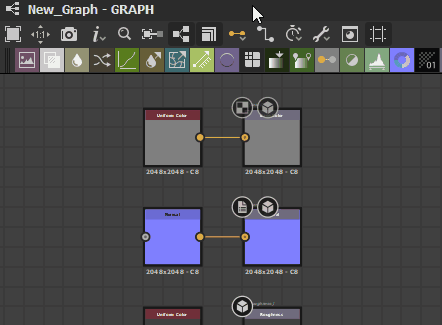

# 비트맵 내보내기

이 페이지에서는 Substance 3D Designer에서 다양한 비트맵 파일 포맷으로 내보내는 방법과 여러 UV 타일을 일괄적으로 내보내는 방법에 대해 설명합니다.[PSD 파일로 내보내려는 경우](https://helpx.adobe.com/kr/substance-3d/unlisted/documentation/sddoc/exporting-psd-186974407.html) [이에 대한 별도의 전용 페이지가 있습니다.](https://helpx.adobe.com/kr/substance-3d/unlisted/documentation/sddoc/exporting-psd-186974407.html)

## 개념 내보내기

비트맵을 내보낼 때는 다음 사항에 유의하는 것이 좋습니다.

* 사용자<b>은(는) 패키지가 아닌 그래프</b>에서 내보냅니다. 패키지는 이미지 콘텐츠를 스스로 생성하지 않습니다.
* 내보낸 비트맵의 수(및 해상도)는 그래프의 <b>출력</b>에 의해 결정됩니다.
* 모든 출력/비트맵에 대해 파일 유형이 설정됩니다.
* 내보내기가 [게시](https://helpx.adobe.com/kr/substance-3d/unlisted/documentation/sddoc/publishing-sbsar-file-200574380.html)와 다릅니다. 차이점을 잘 이해하세요!

## 내보내기 방법

내보낼 준비가 되면 내보내기 대화 상자에 액세스하는 방법은 두 가지입니다.

<table>
<tr style="border: 0;">
<td style="border: 0;" valign="top">

[탐색기 창](https://helpx.adobe.com/kr/substance-3d/unlisted/documentation/sddoc/the-explorer-129368147.html)에서 그래프를 마우스 오른쪽 단추로 클릭하여 내보내고 **&quot;출력을 비트맵으로 내보내기&quot;**&#x200B;를 선택합니다.

</td>
<td style="border: 0;" valign="top">

[그래프 보기](../../interface/the-graph-view/the-graph-view.md)에서 도구 단추 을(를) 클릭하고 **&quot;출력 내보내기...&quot;**&#x200B;를 선택합니다.

</td>
</tr>
</table>

## 내보내기 대화 상자

내보내기 대화 상자에는 내보내기를 사용자 정의할 수 있는 몇 가지 옵션이 있습니다.

오른쪽에 표시된 버전은 표준 대화 상자입니다. 해상도를 변경하면 그래프, 출력에서 또는 대화 상자를 열기 전에 부모 해상도를 설정하여 수행됩니다.

1. <b>대상: </b>저장할 모든 파일의 위치입니다.
1. <b>형식:</b> 파일 형식이 내보낸 모든 파일에 사용되었습니다.
1. <b>패턴</b>: 메타데이터 키워드를 기반으로 파일 형식을 생성하는 제네릭 메서드입니다. 첫 번째 출력을 기반으로 하는 파일 이름의 예는 확인을 위해 아래와 같습니다.\
   다음은 사용 가능한 모든 옵션입니다.
   1. *$(그래프)* - 현재 그래프의 이름
   1. *$(식별자)* - 현재 출력의 식별자
   1. *$(설명)* - 현재 출력에 대한 설명
   1. *$(레이블)* - 현재 출력의 레이블
   1. *$(user\_data)* - 현재 출력의 사용자 정의 사용자 데이터
   1. *$(그룹)* - 현재 출력의 출력 그룹
   1. *$(색상 공간)* - 현재 출력의 색상 공간(*OCIO* 및 *Adobe ACE* [색상 관리](../../color-management/color-management.md) 모드에만 사용 가능)
1. <b>출력:</b> 그래프에서 특정 출력 및 출력 그룹을 켜거나 끕니다. 버튼은 모두 켜거나 끕니다. 하나의 비트맵만 변경된 경우 유용합니다.
1. <b>자동 내보내기:</b> 토글 버튼을 사용하면 그래프 출력을 변경하는 즉시 자동으로 다시 내보낼 수 있습니다. 현재 그래프에만 해당됩니다. 설정에 따라 무겁고 느릴 수 있습니다.
1. <b>내보내기 단추:</b> 현재 설정으로 내보내거나 대화 상자를 닫습니다.

## 내보내기 대화 상자(일괄 처리/UV 타일)

Designer에서 UV-타일 메쉬를 사용하여 작업할 때 [내보내기] 대화 상자를 약간 다른 방식으로 사용하여 여러 UV-타일을 한 번에 일괄 내보낼 수 있습니다. 이 작업 과정을 이해하고 하나 이상의 UV 타일에 [Substance 그래프](../../compositing-graphs/substance-compositing-graphs.md)를 올바르게 할당했는지 확인하세요.\
일괄 처리 탭에서는 작업(상위) 해상도보다 더 빠르게 그래프를 내보낼 수 있습니다.

탐색기의 UV 타일 할당 그래프에서 *마우스 오른쪽 단추를 클릭*&#x200B;하거나 [도구] 단추를 사용할 때 [그래프] 보기에서 *특정 UV 타일 할당 그래프를 열기*&#x200B;했는지 확인하기만 하면 위에 설명된 것과 동일한 방법으로 대화 상자를 시작할 수 있습니다.

1. <b>일괄 처리 탭</b>: 표준 <b>From 그래프 </b>메서드 대신 이 탭을 선택해야 합니다. 그렇지 않으면 옵션 2-3을 사용할 수 없습니다.
1. <b>UV 타일:</b> 출력과 마찬가지로 특정 UV 타일의 내보내기를 켜거나 끌 수 있습니다.
1. <b>[출력 크기](../../compositing-graphs/output-size/output-size.md): </b>내보내기 해상도를 재정의하여 최대 크기로 내보내는 동안 더 작고 더 효율적으로 작업할 수 있습니다.

