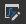
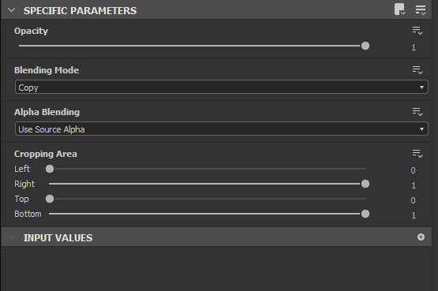
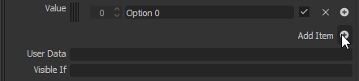

# 매개변수 노출

매개 변수를 노출하는 것은 가장 강력한 도구 중 하나이며, Substance 3D Painter, Substance 3D Sampler 및 Maya와 3DS Max용 Substance 통합 등 다른 응용 프로그램에 그래프를 여는 데 중요합니다.

이 페이지에서는 노출을 시작하는 데 필요한 모든 개념을 설명합니다. 이 페이지에서 계속하기 전에 먼저 Graph 인스턴스의 정의](../../../compositing-graphs/creating-compositing-gra/graph-instances-sub-gra/graph-instances-sub-graphs.md)를 알아보는 것이 좋습니다. [또한 Publish과 내보내기의 차이점과 관련 파일 유형을 [파악하는 것이 좋습니다.](../../../getting-started/overview/overview.md)

*\*위의 점선으로 된 투명한 선은 연결의 추상적 표현입니다.\
노출한 매개 변수에서 그래프 매개 변수로.*

## 매개 변수 이해 및 노출

+++매개 변수란 무엇입니까?
*매개 변수는 그래프의 동작을 제어하는 UI 요소가 있는 단순한 값입니다.* 색상을 변경하거나 혼합 모드를 설정하거나 불투명도 값을 선택하는 등 모든 Substance 소프트웨어에서는 이러한 혼합 모드를 지속적으로 사용할 수 있습니다. 매개 변수가 없으면 Substance 소프트웨어에서 사용자 지정을 전혀 허용하지 않습니다.

매개 변수는 슬라이더, 다이얼, 입력 상자, 드롭다운 메뉴 등 다양한 형태로 제공됩니다. 이 값이 나타내는 유형은 소수점 값, 정수(정수) 값, 부울(true/false) 값, 텍스트 조각 등 다양합니다.

+++

+++노출이란 무엇입니까?
***노출은 현재 그래프 보기 외부에서 매개 변수를 사용할 수 있도록 만드는 프로세스입니다.***  그래프를 빌드할 때는 일반적으로 노드를 선택하여 해당 속성에서 매개 변수를 변경합니다. 표시하면 *외부 제어판에서 이 매개 변수에 액세스할 수 있도록 설정*&#x200B;됩니다. 이 &quot;외부 제어판&quot;은 컨텍스트에 따라 다른 것을 의미할 수 있습니다. Designer 내에서 그래프 인스턴스로 사용할 경우 다른 노드로 작동합니다. Substance 3D Painter, Substance 3D Sampler 또는 통합에서 사용되는 경우 이러한 노출된 매개 변수는 그래프에 대해 *유일하게 제어할 수 있습니다*.

+++

+++노출이 유용한 이유는 무엇입니까?
***매개 변수를 노출하는 것은 Substance 3D Designer이 단순한 텍스처 편집기를 넘어서 사용자 정의 가능한 동적 텍스처 생성 도구를 만들 수 있게 하는 것입니다*** **.** 노출을 하지 않으면 Substance 재질이 정적 텍스처와 크게 다르지 않게 되므로 출력을 수정할 필요가 없습니다.

+++

+++항상 모든 매개 변수를 자동으로 표시하지 않는 이유는 무엇입니까?
<b> [Substance 그래프](../../../compositing-graphs/substance-compositing-graphs.md)는 복잡해질 수 있으며 한 번에 수백 개의 매개 변수를 포함할 수 있습니다. 사용자에게 항상 모든 매개 변수를 표시하는 것은 말이 되지 않습니다. 특히 간단한 목표를 사용하여 그래프를 만드는 경우 많은 매개 변수가 필요하지 않습니다.</b> 매개 변수를 노출할 때 UI 또는 UX 디자이너로 작업합니다. 어떤 컨트롤이 타당한지, 어떤 값이 필요한지, 본인이나 온라인 상의 다른 사용자 또는 동료에게 손쉽게 사용할 수 있는 방법에 대해 생각해 보십시오.

+++

+++노출을 하려면 수학을 알아야 하나요? Substance 함수 그래프를 이해하고 있어야 합니까?
***노출 매개 변수를 잘 활용하거나 함수를 사용하는 데 수학적 지식이 필요하지 않습니다.***  처음 사용자는 [함수 그래프](../../../function-graphs/function-graphs.md)에서 수학적 연산을 거의 완전히 피할 수 있습니다. Integer, Float 및 Boolean과 같은 다양한 데이터 형식에 대한 [적절한 기본 지식만 사용하는 것이 좋습니다.](../../../function-graphs/nodes-reference-for-fun/function-nodes-overview/function-nodes-overview.md)

+++

## 노출 방법

현재 매개 변수를 노출하는 두 가지 기본 메서드가 있습니다. 하나의 방법은 단일 파라미터를 신속하게 노출하는 데 더 적합하고, 두 번째 방법은 하나의 스윕에서 여러 파라미터를 노출하는 데 더 적합하다.

{width="512px"}

### 단일 노출 방법

1. 특정 매개 변수 탭 아래의 [속성](../../../interface/properties/properties.md) 패널에서 표시할 매개 변수를 찾습니다.
1.  드롭다운 옵션 단추를 클릭합니다.
1. 첫 번째 옵션인 드롭다운 목록에서  <b>새 그래프 입력으로 표시</b>를 선택합니다.
1. <b>매개 변수 노출</b> 대화 상자가 나타나면 매개 변수 속성을 원하는 대로 설정합니다.

   적어도 <b>식별자</b> 및 <b>레이블</b>을 변경하는 것이 좋습니다.
1. <b>확인</b>을 눌러 확인
1. 매개 변수의 이름이 *파랑*&#x200B;이 되고 이(가) 됩니다.\
   <b> 매개 변수 함수 편집</b> 단추가 드롭다운 옵션 옆에 표시되어 매개 변수가 표시되는지 확인합니다.

>[!NOTE]
>
> 대부분의 숫자 필드는 *기본 수식*&#x200B;을 입력으로 지원합니다(예: `17+3.5`, `7/3`, `(4+2)*3`). 수식을 확인하려면 *Enter*&#x200B;을(를) 누르면 결과가 필드에 입력됩니다. 공식이 유효하지 않으면 필드가 이전 값으로 되돌아갑니다.\
> [속성](../../../interface/properties/properties.md) 도크와 같은 응용 프로그램의 다른 부분에 있는 일부 숫자 필드도 이 기능을 지원합니다.

{width="512px"}

### 일괄 노출 방법

하나의 매개 변수를 노출할 때 이 방법은 이전보다 약간 느려집니다. 여러 매개 변수를 노출할 때는 훨씬 빠릅니다.

1. 단일 매개 변수를 찾는 대신 <b>특정 매개 변수</b> 탭의 오른쪽 상단에서  <b>다중 노출</b> 단추를 찾습니다.
1. 드롭다운 메뉴에서 <b>일괄 노출 매개 변수...</b>을 선택합니다.
1. 노드의 모든 <b>특정 매개 변수</b>를 표시할 수 있는 <b>일괄 노출</b> 대화 상자가 나타납니다
1. <b>모두</b>, <b>없음</b> 또는 특정 확인란을 사용하여 표시할 매개 변수를 결정합니다.
1. 목록의 <b>그래프 입력 식별자</b> 열 아래에 있는 매개 변수 이름을 클릭하여 이름을 변경합니다.
1. 목록의 <b>그래프 입력 그룹</b> 열 아래에 있는 <b>그룹 이름</b>을 클릭하여 하나의 특정 매개 변수에 (하위) 그룹을 추가합니다.
1. 아래쪽에 있는 <b>그래프 입력 식별자</b> 및 <b>그래프 입력 그룹</b> 입력 상자를 사용하여 표시된 모든 매개 변수에 접두사, 접미사 및 입력 그룹을 한 번에 추가합니다. 이러한 모든 값은 매개 변수별 설정의 맨 위에 적용됩니다.
1. <b>확인</b>을 클릭하여 선택한 모든 매개 변수를 확인하고 표시합니다. 이제 매개 변수 이름에 *파랑*&#x200B;이 표시되어 매개 변수가 노출되었음을 확인할 수 있으며  <b>함수 편집</b> 단추가 표시됩니다.

## 제한 사항

아래 표에 나열된 것처럼 매개 변수를 표시하는 데 몇 가지 제한 사항이 있습니다.

| 매개 변수 유형 | 이유 |
| --- | --- |
| [그레이디언트 경사](../../../compositing-graphs/nodes-reference-for-com/atomic-nodes/gradient-map/gradient-map.md), [곡선 편집기](../../../compositing-graphs/nodes-reference-for-com/atomic-nodes/curve/curve.md), [글꼴](../../../compositing-graphs/nodes-reference-for-com/atomic-nodes/text/text.md), [레벨 막대 그래프](../../../compositing-graphs/nodes-reference-for-com/atomic-nodes/levels/levels.md) | 사용자가 만든 매개 변수에 사용할 수 없는 위젯이 필요합니다. |

다른 중요한 제한 사항은 [정적 매개 변수](../../../glossary/glossary.md)와 관련이 있습니다. [게시된 Substance 3D 에셋(SBSAR)](../../publishing-asset-files/publishing-substance-3d-asset-files-sbsar.md)에서 변경할 수 없습니다.

정적 매개 변수 - 동적 매개 변수와는 반대로 - *그래프를*&#x200B;조리&#x200B;*한 후에는 즉시 편집할 수 없습니다*. 즉, 알고리즘을 빠르고 효율적으로 실행하기 위해 처리됩니다. 그래프가 *편집* 또는 *게시*&#x200B;될 때마다 Designer에서 요리가 수행됩니다.

따라서 정적 매개 변수는 Designer에서 표시되고 편집할 수 있지만 게시된 Substance 3D 에셋에서는 *숨김*&#x200B;됩니다. Substance 3D 에셋에 게시하기 전에 [미리 보기] 모드를 사용하여 이러한 제한 사항을 확인할 수 있습니다. 아래의 &#39;매개 변수 미리 보기&#39;를 참조하십시오.

해결 방법으로 [스위치](../../../compositing-graphs/nodes-reference-for-com/node-library/filters/blending/switch/switch.md) 또는 [다중 스위치](../../../compositing-graphs/nodes-reference-for-com/node-library/filters/blending/multi-switch/multi-switch.md) 노드와 여러 논리 집합을 사용하여 이러한 매개 변수에 대해 다른 값/상태 간에 전환할 수 있습니다.

| 노드 | 매개변수 |
| --- | --- |
| 모든 노드 | 타일링 모드 픽셀 비율 |
| [균일한 색상](../../../compositing-graphs/nodes-reference-for-com/atomic-nodes/uniform-color/uniform-color.md) | 색상 모드 |
| [픽셀 프로세서](../../../compositing-graphs/nodes-reference-for-com/atomic-nodes/pixel-processor/pixel-processor.md) | 색상 모드 |
| [혼합](../../../compositing-graphs/nodes-reference-for-com/atomic-nodes/blend/blend.md) | 혼합 모드 Alpha 혼합 자르기 영역 |
| [FX-Map](../../../compositing-graphs/nodes-reference-for-com/atomic-nodes/fx-map/fx-map.md) | 혼합 모드 |
| [사분면](../../../function-graphs/fxmaps/the-quadrant-node/the-quadrant-node.md) | 패턴 입력 이미지 알파 입력 이미지 필터링 |

## 노출된 매개 변수 수정

일단 노출되면 이전과 같은 매개변수에 더 이상 액세스할 수 없습니다. 값을 변경하고, 이름을 바꾸고, UI에서 정렬하고, 매개 변수를 제거하는 작업도 그래프 속성 수준에서 수행됩니다. 이 섹션에서는 이 방법에 대해 자세히 설명합니다.

노출된 매개 변수의 옵션을 변경하려면 다음 작업을 수행하십시오.

1. 이미 표시된 매개 변수 옆의 드롭다운 옵션 단추 을(를) 클릭합니다.
1. <b> 노출된 그래프 입력 편집</b>을(를) 선택합니다. 그러면 그래프 속성의 관련 항목으로 바로 이동합니다
1. 그래프의 빈 영역을 두 번 클릭하여 그래프 속성으로 이동한 다음 <b>입력 매개 변수</b> 목록에서 매개 변수를 찾습니다
1. <b>탐색기</b>에서 그래프를 한 번 클릭한 다음 <b>입력 매개 변수</b> 목록에서 매개 변수를 찾습니다.

{width="512px"}

### 입력 매개 변수

노출된 모든 매개변수가 입력 매개변수(Input Parameters) 탭에 나열됩니다. 다음 속성은 기본 편집기 유형의 부동 소수점 및 정수와 같은 대부분의 일반적인 경우에 사용할 수 있습니다.

1. <b>식별자</b>: 이 매개 변수의 고유 식별자입니다. 공백 또는 특수 문자는 사용할 수 없습니다.
1. <b>레이블</b>: UI 전용 레이블. 레이블이 정의되지 않은 경우 UI에 식별자가 표시됩니다. 공백 및 특수 문자를 포함할 수 있습니다.
1. <b>그룹</b>: 매개 변수의 긴 목록을 정리하고 관리할 수 있도록 매개 변수를 축소 가능한 섹션으로 그룹화합니다. 매개 변수는 *정확히 같은* 그룹 이름을 공유하는 경우 함께 그룹화됩니다. `/` 문자를 사용하여 *하위 그룹*&#x200B;을(를) 만듭니다(예: `My Group/My Sub-group`).
1. <b>설명</b>: 설명을 위한 텍스트 필드이며 도구 설명으로 사용됩니다.
1. <b>유형/편집기</b>: 데이터 유형과 UI 편집기 유형을 설정합니다. 특정 편집기는 특정 데이터 형식(예: Integer에 대해서만 드롭다운 목록)에만 사용할 수 있습니다. *편집기를 변경하면 대부분 기본값이 지워집니다.*
1. <b>기본값</b>: 매개 변수가 시작되는 기본값. 이 값은 노드를 미리 보는 동안 그래프에 사용되는 값이기도 합니다. 여기서 쉽고 사용할 수 있는 값을 사용하여 극단적인 경우를 피하십시오.
1. <b>최소</b>: UI의 최소값
1. <b>최대</b>: UI의 최대값
1. <b>클램프</b>: 최소 및 최대값이 소프트 또는 하드 제한인지 설정합니다(사용자가 제한을 초과할 수 있도록 허용).
1. 값의 정밀도 또는 세분성을 <b>단계</b>:Set합니다.
1. <b>사용자 데이터: </b>사용자 지정 사용자 데이터로, 어떤 목적으로든 사용할 수 있습니다.
1. <b>보이는 경우</b>: 외부 조건에 따라 매개 변수를 표시하거나 숨기는 특수 식 시스템입니다. [다음 경우 표시: 입력, 출력 및 매개 변수의 표시 여부 제어](../../../compositing-graphs/visible-control-vis/visible-if-control-visibility-of-inputs-outputs-and-parameters.md) 참조

{width="512px"}

#### 드롭다운 목록

특수한 경우 Integer 형식의 <b>드롭다운 목록</b>이 사용됩니다. 기본값(Default), 최소값(Min) 또는 최대값(Max)은 없으며 항목 목록을 정의할 수 있는 하나의 값 설정만 가능합니다.

* 모든 항목은 드롭다운 목록의 항목에 해당합니다.
* 항목의 첫 번째 값은 그래프에서 사용하는 실제 내부 정수입니다. 예를 들어 [다중 스위치](../../../compositing-graphs/nodes-reference-for-com/node-library/filters/blending/multi-switch/multi-switch.md)에 대해 올바르게 설정되었는지 확인하십시오(0이 아닌 1에서 시작).
* 두 번째 값은 사용자에게 표시되는 UI 레이블입니다.
* 세 번째 확인란을 사용하면 한 항목을 기본적으로 선택된 항목으로 표시할 수 있습니다.
* X가 항목을 삭제하고 +가 항목을 추가합니다.

{width="512px"}

#### 재주문

어두운 스트라이프 핸들을 목록에서 입력 매개 변수 이름 왼쪽으로 드래그하여 놓으면 매개 변수 순서를 손쉽게 변경할 수 있습니다. 그룹화 매개 변수는 순서에 영향을 줄 수 있습니다.

{width="512px"}

### 매개 변수 미리 보기

최종 결과를 보지 않으면 매개 변수를 설정하는 것이 어려울 수 있으므로 <b>미리 보기 모드</b>를 활성화하여 매개 변수 UI가 어떻게 보이고 외부적으로 동작하는지 확인할 수 있습니다. 입력 매개 변수 롤아웃의 가운데 위에 있는 <b>미리 보기</b> 탭을 클릭합니다.

일반적으로 <b>미리 보기 모드</b>에서 변경한 내용은 *취소*&#x200B;됩니다. 그러나 눈 아이콘 옆에 있는 <b>적용 단추 </b>를 사용하여 <b> 미리 보기 모드</b>의 현재 값을 *새 기본값*&#x200B;으로 설정할 수 있습니다.

[미리 보기 모드를 사용하면 포함된 사전 설정을 만들 수도 있습니다.](../../../compositing-graphs/manage-parameters/parameter-presets/parameter-presets.md)

>[!IMPORTANT]
>
> [직접 편집](../../../interface/preferences-window/preferences-window.md)을 사용하는 경우 미리 보기 모드를 사용할 수 없습니다.

>[!WARNING]
>
> 미리 보기 모드는 [게시된 Substance 3D 에셋(SBSAR)](../../publishing-asset-files/publishing-substance-3d-asset-files-sbsar.md)의 경험을 가능한 한 정확하게 나타내는 것을 목표로 합니다. 따라서 *정적 매개 변수가 목록에 없는 경우*&#x200B;와 같이 이 페이지에 나열된 제한 사항이 이 모드에 적용됩니다.

{width="512px"}

### 매개변수 복사-붙여넣기

그래프 간에 매개변수를 복사하여 붙여넣을 수 있습니다.

복사 단추 을(를) 사용하여 단일 매개 변수를 복사할 수 있습니다. 매개 변수 메뉴 을(를) 통해 여러 매개 변수를 복사할 수 있습니다. 모든 입력을 복사하려면 입력 복사 를 선택합니다.

매개 변수 메뉴 에서 입력  붙여넣기를 선택하여 하나 이상의 매개 변수를 붙여넣습니다.

실제 노출된 매개 변수 자체가 아닌 값을 전송하려는 경우 [매개 변수 사전 설정에 대해 읽어보십시오.](../../../compositing-graphs/manage-parameters/parameter-presets/parameter-presets.md)

## 노출된 매개 변수 제거 및 정리

매개 변수의 특성상, 입력 매개 변수에서 여러 노드를 제어할 수 있거나, 입력 매개 변수가 노드를 제어하지 않고 존재할 수 있는 경우, 누락된 매개 변수 또는 사용되지 않은 매개 변수에 문제가 발생할 수 있습니다. 다음은 일반적인 문제 및 해결 방법에 대해 설명합니다.

{width="512px"}

### 노드에서 끊어진 매개변수 추적

그래프 보기의 위쪽 막대에 있는 노드 찾기 도구 을(를) 통해 각 노드에서 사용하는 매개 변수를 추적할 수 있습니다. 이 버튼을 클릭하면 특정 매개변수를 사용하여 노드를 찾을 수 있습니다.

노드에 실제 문제가 있는 경우 왼쪽 상단 모서리에 경고 배지 이(가) 표시됩니다. 배지 위로 마우스를 가져가면 추가 정보가 있는 도구 설명이 표시됩니다.

문제를 재설정하고 제거하려면 수정하거나 재설정하려는 매개 변수에 대해 [함수 편집] 단추 옆에 있는 드롭다운 단추 을(를) 클릭하고  <b>재설정을 선택합니다. </b>매개 변수를 이전에 표시되지 않은 상태로 되돌립니다. 그러면 파란색 이름이 회색으로 다시 바뀌어 이를 반영합니다.

{width="512px"}

### 사용하지 않는 입력 매개 변수 정리

입력 매개 변수의 트랙이 손실되고 어떤 매개 변수가 사용되는지 더 이상 알 수 없는 경우 작은 도구를 사용하여 정리할 수 있습니다. 입력 매개 변수 메뉴 단추 을(를) 클릭하고 <b>입력 정리</b>를 선택합니다.

사용하지 않은 모든 매개 변수를 나열하는 새 대화 상자가 나타납니다. 제거하거나 유지하려는 매개 변수를 선택하거나 선택 해제하고 [확인]을 클릭합니다. 대화 상자가 표시되지 않으면 현재 정리할 사용하지 않은 매개 변수가 없습니다.

{width="512px"}

### 매개 변수 제거

사용 중인 매개 변수를 실제로 제거하려면 두 가지 개별 단계가 필요합니다.

1. 표시된 매개 변수가 있는 노드에서 함수 표시 단추의 오른쪽에 있는 드롭다운 화살표를 클릭하십시오. 이 단추는 파란색으로 표시됩니다. . 그런 다음 &quot;기본값으로 재설정&quot;을 선택합니다. 이렇게 하면 이 한 노드에서 매개 변수 사용이 제거됩니다. 동일한 매개변수를 사용하는 다른 노드에 대해서도 반복합니다. &quot;기본값으로 재설정&quot;을 사용하면 매개 변수 위젯의 범위도 *소프트 범위*(으)로 재설정됩니다.
1. 그래프의 입력 매개변수(Input Parameters) 목록에서 매개변수 항목 오른쪽의 X 를 클릭합니다. 그러면 매개변수가 완전히 삭제됩니다. 노드가 이 매개 변수를 사용하려고 하면 경고 배지가 나타납니다(위 참조).
