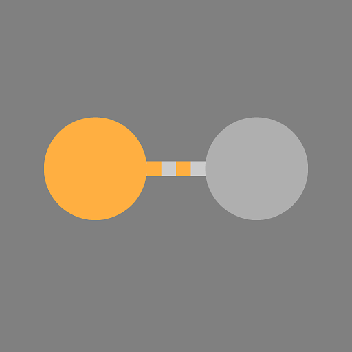

# 원자성 노드

원자 노드는 Substance 그래프의 기본 구성 요소입니다.

[라이브러리](../../../interface/the-library/the-library.md)에 있는 다른 모든 Substance 그래프 노드는 원자 노드로 만들어집니다. 해당 노드를 최하위 수준으로 세분화해야 합니다.

<table>
<tr style="border: 0;">
<td style="border: 0;" valign="top">

[비트맵](../../../compositing-graphs/nodes-reference-for-com/atomic-nodes/bitmap/bitmap.md)

</td>
<td style="border: 0;" valign="top">

[혼합](../../../compositing-graphs/nodes-reference-for-com/atomic-nodes/blend/blend.md)

</td>
<td style="border: 0;" valign="top">

[흐림 효과](../../../compositing-graphs/nodes-reference-for-com/atomic-nodes/blur/blur.md)

</td>
<td style="border: 0;" valign="top">

[곡선](../../../compositing-graphs/nodes-reference-for-com/atomic-nodes/curve/curve.md)

</td>
<td style="border: 0;" valign="top">

[방향 흐림](../../../compositing-graphs/nodes-reference-for-com/atomic-nodes/directional-blur/directional-blur.md)

</td>
</tr>
</table>

<table>
<tr style="border: 0;">
<td style="border: 0;" valign="top">

[방향성 뒤틀기](../../../compositing-graphs/nodes-reference-for-com/atomic-nodes/directional-warp/directional-warp.md)

</td>
<td style="border: 0;" valign="top">

[엠보스](../../../compositing-graphs/nodes-reference-for-com/atomic-nodes/emboss/emboss.md)

</td>
<td style="border: 0;" valign="top">

[거리](../../../compositing-graphs/nodes-reference-for-com/atomic-nodes/distance/distance.md)

</td>
<td style="border: 0;" valign="top">

[그래디언트(동적)](../../../compositing-graphs/nodes-reference-for-com/atomic-nodes/gradient-dynamic/gradient-dynamic.md)

</td>
<td style="border: 0;" valign="top">

[그레이디언트 맵](../../../compositing-graphs/nodes-reference-for-com/atomic-nodes/gradient-map/gradient-map.md)

</td>
</tr>
</table>

<table>
<tr style="border: 0;">
<td style="border: 0;" valign="top">

[FX-Map](../../../compositing-graphs/nodes-reference-for-com/atomic-nodes/fx-map/fx-map.md)

</td>
<td style="border: 0;" valign="top">

[회색 음영 전환](../../../compositing-graphs/nodes-reference-for-com/atomic-nodes/grayscale-conversion/grayscale-conversion.md)

</td>
<td style="border: 0;" valign="top">

[HSL](../../../compositing-graphs/nodes-reference-for-com/atomic-nodes/hsl/hsl.md)

</td>
<td style="border: 0;" valign="top">

[색상 입력](../../../compositing-graphs/nodes-reference-for-com/atomic-nodes/input/input.md)

</td>
<td style="border: 0;" valign="top">

[회색 음영 입력](../../../compositing-graphs/nodes-reference-for-com/atomic-nodes/input/input.md)

</td>
</tr>
</table>

<table>
<tr style="border: 0;">
<td style="border: 0;" valign="top">

[값 입력](../../../compositing-graphs/nodes-reference-for-com/atomic-nodes/input/input.md)

</td>
<td style="border: 0;" valign="top">

[레벨](../../../compositing-graphs/nodes-reference-for-com/atomic-nodes/levels/levels.md)

</td>
<td style="border: 0;" valign="top">

[법선](../../../compositing-graphs/nodes-reference-for-com/atomic-nodes/normal/normal.md)

</td>
<td style="border: 0;" valign="top">

[출력](../../../compositing-graphs/nodes-reference-for-com/atomic-nodes/output/output.md)

</td>
<td style="border: 0;" valign="top">

[픽셀 프로세서](../../../compositing-graphs/nodes-reference-for-com/atomic-nodes/pixel-processor/pixel-processor.md)

</td>
</tr>
</table>

<table>
<tr style="border: 0;">
<td style="border: 0;" valign="top">

[선명하게 하기](../../../compositing-graphs/nodes-reference-for-com/atomic-nodes/sharpen/sharpen.md)

</td>
<td style="border: 0;" valign="top">

[채널 셔플](../../../compositing-graphs/nodes-reference-for-com/atomic-nodes/channel-shuffle/channel-shuffle.md)

</td>
<td style="border: 0;" valign="top">

[SVG](../../../compositing-graphs/nodes-reference-for-com/atomic-nodes/svg/svg.md)

</td>
<td style="border: 0;" valign="top">

[텍스트](../../../compositing-graphs/nodes-reference-for-com/atomic-nodes/text/text.md)

</td>
<td style="border: 0;" valign="top">

[2D 변환](../../../compositing-graphs/nodes-reference-for-com/atomic-nodes/transformation-2d/transformation-2d.md)

</td>
</tr>
</table>

<table>
<tr style="border: 0;">
<td style="border: 0;" valign="top">

[균일 색상](../../../compositing-graphs/nodes-reference-for-com/atomic-nodes/uniform-color/uniform-color.md)

</td>
<td style="border: 0;" valign="top">

[값 프로세서](../../../compositing-graphs/nodes-reference-for-com/atomic-nodes/value-processor/value-processor.md)

</td>
<td style="border: 0;" valign="top">

[뒤틀기](../../../compositing-graphs/nodes-reference-for-com/atomic-nodes/warp/warp.md)

</td>
<td style="border: 0;" valign="top">

</td>
<td style="border: 0;" valign="top">

</td>
</tr>
</table>

## 원자 노드 배치

Substance 그래프에 여러 가지 방법으로 원자 노드를 만들 수 있습니다.

### <b>노드 팔레트</b>

이 노드 팔레트는 [그래프 보기 도구 모음](../../../interface/the-graph-view/the-graph-view.md)에 있으며 원자 노드에 쉽게 액세스할 수 있습니다. 노드를 클릭하거나 그래프에서 끌기만 하면 됩니다.

이 단추를 사용하여 팔레트를 전환합니다. 

### <b>노드 메뉴</b>

그래프 보기에서 *스페이스바* 또는 *Tab*&#x200B;을 누르면 검색 가능한 노드 목록이 표시되고 기본적으로 모든 원자 노드가 나열됩니다.

검색 필드를 사용하면 [자신의 콘텐츠](../../../interface/the-library/managing-custom-content/managing-custom-content-and-filters.md)(추가된 경우)를 포함하여 [라이브러리의 다른 모든 노드](../../../compositing-graphs/nodes-reference-for-com/node-library/node-library.md)를 찾아볼 수 있습니다.

### <b>그래프 상황별 메뉴</b>

그래프를 마우스 오른쪽 버튼으로 클릭하고 &#39;노드 추가&#39; 하위 메뉴로 이동하여 원자 노드 목록에 액세스합니다.

### <b>라이브러리</b>

[라이브러리](../../../interface/the-library/the-library.md)의 &#39;Atomic nodes&#39; 범주가 모든 atomic 노드를 호스팅합니다. Substance 그래프로 드래그 앤 드롭할 수 있습니다.

### <b>키보드 바로 가기</b>

[사용자 고유의 키보드 단축키](../../../interface/preferences-window/preferences-window.md)를 정의하여 원자 노드를 포함한 그래프의 모든 노드를 즉시 만들 수 있습니다.
