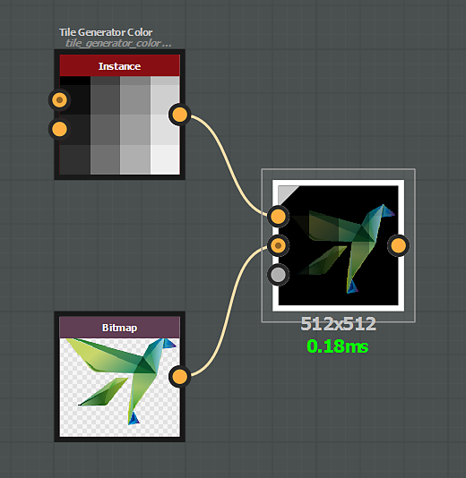

# 혼합 모드

[혼합](../../../../../compositing-graphs/nodes-reference-for-com/atomic-nodes/blend/blend.md) 노드는 다음 혼합 모드를 제공합니다.

## 복사

*복사* 혼합 모드는 전경을 배경 위에 배치합니다.

{zoomable="yes"}

색상 이미지의 경우 기본적으로 불투명도에서 알파 채널이 고려됩니다.

&#39;알파 혼합&#39; 매개 변수를 사용하여 변경할 수 있습니다.

"){zoomable="yes"}

## 추가(선형 닷지)

*추가* 혼합 모드를 사용하면 배경의 각 해당 픽셀에 전경 입력 값이 추가됩니다.

"){zoomable="yes"}

## 빼기

*빼기* 혼합 모드는 배경의 각 해당 픽셀에서 전경 입력 값을 빼냅니다.

빼기의 결과가 0보다 낮으면, 그 값은 0으로 캡핑되므로 순수한 검정이 된다.

{zoomable="yes"}

## 곱하기

*곱하기* 혼합 모드에서는 배경 입력 값에 전경의 해당 픽셀을 각각 곱합니다.

각 픽셀의 값이 0과 1 사이에 포함되어 있으므로 원본과 항상 같거나 더 낮습니다(더 어둡게).

{zoomable="yes"}

## 하위 추가

*하위 항목 추가* 혼합 모드는 다음과 같이 작동합니다.

* 값이 0.5보다 큰 전경 픽셀은 해당 배경 픽셀에 추가됩니다.
* 값이 0.5보다 낮은 전경 픽셀을 배경의 해당 픽셀에서 뺍니다.

{zoomable="yes"}

## 최대(밝게)

*최대* 혼합 모드는 배경과 전경 중 더 높은 값을 선택합니다.

"){zoomable="yes"}

## 최소(어둡게)

*최소* 혼합 모드는 배경과 전경 중 더 낮은 값을 선택합니다.

"){zoomable="yes"}

## 전환

*전환* 혼합 모드는 복사 모드와 비슷하며 *중요* 차이가 있습니다.

* &#39;불투명도&#39;를 0으로 설정: &#39;전경&#39; 입력 *에 연결된 노드의 스트림이 계산되지 않습니다*.
* &#39;불투명도&#39;를 1로 설정: &#39;배경&#39; 입력 *에 연결된 노드의 스트림이 계산되지 않습니다*.

따라서 이 모드를 사용하여 그래프의 성능을 개선할 수 있습니다.

이러한 특정 구성에서 혼합 노드를 사용하도록 [전환](../../../../../compositing-graphs/nodes-reference-for-com/node-library/filters/blending/switch/switch.md) 및 [회색 음영 전환](../../../../../compositing-graphs/nodes-reference-for-com/node-library/filters/blending/switch/switch.md) 노드가 설정되어 있습니다.

{zoomable="yes"}

## 나누기

*나누기* 혼합 모드는 배경 입력 픽셀 값을 전경의 해당 픽셀로 나눕니다.

{zoomable="yes"}

## 오버레이

*오버레이* 혼합 모드는 곱하기 및 화면 혼합 모드를 결합합니다.

* &#x200B;
  * 하위 레이어 픽셀의 값이 0.5 미만이면 *곱하기* 유형 혼합이 적용됩니다
  * 하위 레이어 픽셀의 값이 0.5 이상이면 *스크린* 유형 혼합이 적용됩니다

{zoomable="yes"}

## 화면

[스크린 혼합 모드]를 사용하면 두 입력에 있는 픽셀 값이 반전되고, 곱해진 다음 다시 반전됩니다.

그 결과는 곱하는 것과 반대의 결과이며, 원본과 비교했을 때 항상 같거나 더 밝습니다(더 밝음).

{zoomable="yes"}

## 소프트 라이트

소프트 라이트 혼합 모드는 전경색의 밝기에 따라 미세한 더 밝거나 더 어두운 결과를 만듭니다.

50% 이상의 명도를 포함하는 혼합 색상은 배경 픽셀을 밝게 하고 50% 미만의 명도를 포함하는 색상은 배경 픽셀을 어둡게 합니다.

{zoomable="yes"}
