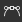
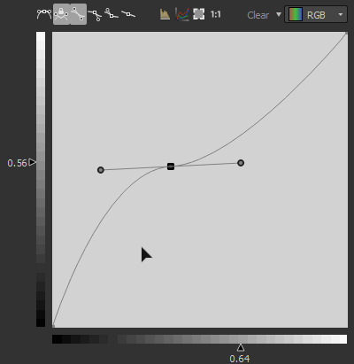

# 곡선

<table>
<tr style="border: 0;">
<td width="33.33%" style="border: 0;" valign="top">

{width="200px"}

</td>
<td width="100.00%" style="border: 0;" valign="top">

사용자 지정 곡선을 사용하여 이미지의 값을 재매핑합니다.

노드는 다른 2D 이미지 편집 애플리케이션들과 유사하게, 이미지 톤 리매핑에 대한 인터페이스를 제공한다. 사용자는 점을 배치하고 베지어 곡선을 조정하여 입력을 다시 매핑할 수 있습니다. 이 때 입력은 회색 음영이나 색상이 될 수 있습니다.이 기능은 특히 그래디언트 전환과 함께 사용하여 특정 Height 프로파일에 다시 매핑할 때 유용하며, 경사 프로파일 등을 매우 정밀하게 모델링할 수 있습니다.

</td>
</tr>
</table>

대부분의 다른 노드와 달리 곡선 노드에는 슬라이더와 매개 변수가 있는 일반적인 표준 인터페이스가 없지만, 대신 완전한 곡선 편집기를 제공합니다. 사용 방법에 대해서는 아래의 확장 가능 섹션을 참조하십시오.

[하지만 곡선 노드의 매개 변수를 하위 그래프에 노출할 수 없습니다](../../../../compositing-graphs/manage-parameters/exposing-a-parameter/exposing-a-parameter.md). 여기서 유일한 옵션은 [다중 스위치](../../../../compositing-graphs/nodes-reference-for-com/node-library/filters/blending/multi-switch/multi-switch.md)를 사용하여 다른 곡선 프로필 간에 전환하는 것입니다.

<table>
<tr style="border: 0;">
<td width="100.00%" style="border: 0;" valign="top">

</td>
<td width="83.33%" style="border: 0;" valign="top">

</td>
<td width="100.00%" style="border: 0;" valign="top">

</td>
</tr>
</table>

<table>
<tr style="border: 0;">
<td style="border: 0;" valign="top">

## 매개변수

### 곡선 편집기

</td>
<td style="border: 0;" valign="top">

### 입력 커넥터

### 출력 커넥터

</td>
<td style="border: 0;" valign="top">

### 예

</td>
</tr>
</table>

## 매개변수

|  |  |
| --- | --- |
| <b>곡선 적용/노출</b> *부울* | 사용자 곡선을 입력 이미지에 적용하지 않고 출력에 복사할 수 있습니다 |
| <b>곡선 주소 지정</b> *부울* | 이 매개 변수는 입력의 [0, 1] 범위를 벗어나는 HDR 픽셀을 처리하는 방법을 결정합니다. 클램프하거나 [0, 1]까지 접습니다. |
| <b>곡선</b> *곡선 키 배열* | 입력 회색 음영 값을 매핑하는 데 사용되는 사용자 정의 곡선입니다.   [곡선 편집기](#curve-editor)를 사용하여 편집할 수 있습니다. |

## 곡선 편집기

### 점 만들기 및 이동

점을 만들려면 곡선 보기의 아무 곳이나 두 번 클릭하면 됩니다.

### 점 영향 제어

<table>
<tr style="border: 0;">
<td width="100.00%" style="border: 0;" valign="top">

정확한 결과를 얻기 위해 곡선 노드는 각 점에 대해 서로 다른 모드를 제공합니다.

</td>
<td width="33.33%" style="border: 0;" valign="top">

</td>
</tr>
</table>

 지점 모드를 기본값으로 다시 설정합니다.

 사용자가 함께 또는 독립적으로 이동할 수 있도록 2 베지어 핸들러를 잠그거나 잠금 해제합니다.

 지점의 양쪽은 베지어 처리기로 제어됩니다.

 지점의 오른쪽은 베지어 핸들러에 의해 제어되고 왼쪽은 평평하게 유지됩니다.

 점의 왼쪽은 베지어 핸들러에 의해 제어되고 오른쪽은 평평하게 유지됩니다.

 점 면이 평평하게 유지됩니다

### 입력 막대 그래프 표시

을(를) 클릭하기만 하면 입력 히스토그램을 표시하거나 숨길 수 있습니다.

### 각 채널을 개별적으로 제어(색상 입력)

<table>
<tr style="border: 0;">
<td width="100.00%" style="border: 0;" valign="top">

색상 노드를 입력하면 각 채널의 곡선을 조정할 수 있습니다.

오른쪽 상단에 있는 드롭다운 목록에서 조정하려는 곡선을 선택합니다.

</td>
<td width="33.33%" style="border: 0;" valign="top">

</td>
</tr>
</table>

RGB 곡선 모드에서 을(를) 누르거나 눌러 개별 채널 곡선을 숨기거나 표시할 수 있습니다.

### 정렬, 미러링 및 뒤집기

<table>
<tr style="border: 0;">
<td width="100.00%" style="border: 0;" valign="top">

곡선 보기를 마우스 오른쪽 버튼으로 클릭하면 더 많은 옵션이 제공됩니다.

<b>위쪽 맞춤:</b> 선택한 점을 가장 높은 위치에 수평으로 맞춥니다.

<b>가운데 맞춤:</b> 선택한 점을 선택 영역의 평균 Height에 수평으로 맞춥니다.

<b>아래쪽 맞춤:</b> 선택한 점을 가장 낮은 점에 수평으로 맞춥니다.

</td>
<td width="50.00%" style="border: 0;" valign="top">

</td>
</tr>
</table>

<b>가로/세로 분포:</b> 선택한 축에 점을 분포합니다

<b>수평/수직으로 뒤집기:</b> 선택한 축을 따라 선택한 점을 뒤집습니다.

<b>수평/수직으로 미러링:</b> 선택한 축에 따라 전체 곡선을 미러링합니다

### 키보드 단축키

<table>
<tr style="border: 0;">
<td style="border: 0;" valign="top">

<b>LMB + 드래그</b>

선택 상자를 그립니다.

</td>
<td style="border: 0;" valign="top">

</td>
</tr>
</table>

<table>
<tr style="border: 0;">
<td style="border: 0;" valign="top">

<b>Shift + 드래그</b>

X축 또는 Y축의 움직임을 제한합니다.

</td>
<td style="border: 0;" valign="top">

</td>
</tr>
</table>

<table>
<tr style="border: 0;">
<td style="border: 0;" valign="top">

<b>Alt + LMB + 드래그</b>

핸들을 일시적으로 해제하여 독립적으로 이동합니다.

</td>
<td style="border: 0;" valign="top">

</td>
</tr>
</table>

### 곡선의 프레임 조정

처리기를 조정하는 동안 하나의 처리기가 곡선 보기를 넘는 경우 오류가 발생할 수 있습니다.

이 경우  단추를 사용하여 콘텐츠에 크기를 맞출 수 있습니다.

 단추를 사용하면 확대/축소 수준이 1로 재설정됩니다

## 입력 커넥터

|  |  |
| --- | --- |
| <b>입력</b> 기본 *회색 음영/색상* | 처리할 이미지. |

## 출력 커넥터

|  |  |
| --- | --- |
| <b>출력</b> *회색 음영/색상* |  |

## 예

*곧 출시 예정*
