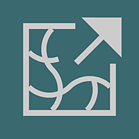

# 방향성 뒤틀기

<table>
<tr style="border: 0;">
<td width="33.33%" style="border: 0;" valign="top">

{width="200px"}

</td>
<td width="100.00%" style="border: 0;" valign="top">

강도 맵에 따라 지정된 방향으로 픽셀을 변위하여 변형을 일으킬 수 있습니다.

사용자가 설정한 방향으로 입력을 뒤틀고 사용자가 설정한 강도 맵을 곱합니다. 이 효과는 [뒤틀기]와 비슷하게 작동하지만 특정 방향으로만 작동합니다.

</td>
</tr>
</table>

뒤틀기 노드는 매우 간단하지만 유용한 노드로서 다른 더 진보된 효과를 위한 훌륭한 기반이 된다. [경사 흐림](../../../../compositing-graphs/nodes-reference-for-com/node-library/filters/blurs/slope-blur/slope-blur.md) 및 [벡터 뒤틀기](../../../../compositing-graphs/nodes-reference-for-com/node-library/filters/effects/vector-warp/vector-warp.md)와 같은 더 고급 대안이 있습니다.

<table>
<tr style="border: 0;">
<td width="100.00%" style="border: 0;" valign="top">

</td>
<td width="83.33%" style="border: 0;" valign="top">

</td>
<td width="100.00%" style="border: 0;" valign="top">

</td>
</tr>
</table>

<table>
<tr style="border: 0;">
<td style="border: 0;" valign="top">

## 출력 커넥터

</td>
<td style="border: 0;" valign="top">

### 예

</td>
</tr>
</table>

## 매개변수

|  |  |
| --- | --- |
| <b>강도</b> *부동* | 뒤틀기의 강도를 설정합니다. |
| <b>뒤틀기 각도</b> *부동* | 뒤틀기 효과의 각도를 회전 수로 설정합니다. |
| <b>필터링 모드 입력</b> *부울* | <b>입력</b>을 샘플링하는 데 가장 가까운 필터링을 사용할지 또는 쌍선형 필터링을 사용할지 여부를 제어합니다. |
| <b>강도 맵 오프셋</b> *부동* | <b>강도 입력</b> 이미지 값에서 이 값을 뺍니다. |

## 입력 커넥터

|  |  |
| --- | --- |
| <b>입력</b> 기본 *회색 음영/색상* | 뒤틀기 효과를 적용해야 하는 회색 음영 또는 색상 입력 이미지입니다. |
| <b>강도 입력</b> *회색 음영* | <b>입력</b> 이미지에 적용할 뒤틀기의 양을 정의하는 회색 음영 이미지입니다. |

## 출력 커넥터

|  |  |
| --- | --- |
| <b>출력</b> *회색 음영/색상* |  |

## 예

<table>
<tr style="border: 0;">
<td style="border: 0;" valign="top">

{zoomable="yes"}

</td>
<td style="border: 0;" valign="top">

{zoomable="yes"}

</td>
<td style="border: 0;" valign="top">

{zoomable="yes"}

</td>
</tr>
</table>
