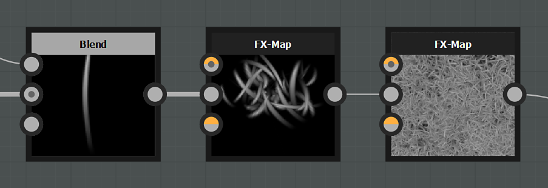

# FX-Map

<table>
<tr style="border: 0;">
<td width="33.33%" style="border: 0;" valign="top">

{width="200px"}

</td>
<td width="100.00%" style="border: 0;" valign="top">

FX-Map은 이미지나 패턴 입력을 반복해서 복제 및 세분화할 수 있으며, 매개 변수와 논리 함수 덕분에 각 패턴의 분포를 제어할 수 있습니다.

이 노드는 가장 강력한 원자 노드 중 하나이며 응용 프로그램에서 사용 가능한 가장 복잡한 노드입니다.

</td>
</tr>
</table>

[픽셀 프로세서](../../../../compositing-graphs/nodes-reference-for-com/atomic-nodes/pixel-processor/pixel-processor.md)와 마찬가지로 이 노드의 동작과 출력을 결정하는 함수를 정의하고 만드는 것은 사용자의 몫입니다.

<table>
<tr style="border: 0;">
<td width="100.00%" style="border: 0;" valign="top">

</td>
<td width="83.33%" style="border: 0;" valign="top">

</td>
<td width="100.00%" style="border: 0;" valign="top">

</td>
</tr>
</table>

>[!TIP]
>
> FX-Map 프로세스에 대해 자세히 알아보고 이해하려면 [전용 안내서](../../../../function-graphs/fxmaps/fxmaps.md)를 살펴보십시오.

>[!IMPORTANT]
>
> FX-Map 노드를 사용하기 전에 소프트웨어의 모든 측면을 잘 알고 있고 매개 변수에 대한 [수학 함수](../../../../function-graphs/function-graphs.md)를 만드는 데 문제가 없는 것이 좋습니다.

## 예

## 매개변수

다른 노드와 달리 FX-Map의 대부분의 동작은 매개 변수에 의해 결정되지 않고 그 안에 있는 [FX-Map 함수](../../../../function-graphs/fxmaps/fxmaps.md)를 편집함으로써 결정됩니다.

|  |  |
| --- | --- |
| <b>색상 모드</b> *부울* | 회색 음영과 색상 출력 이미지 사이를 전환합니다. 색상은 회색 음영보다 훨씬 느립니다. |
| <b>배경</b> *Float/Float4* | 결과를 합성할 배경 시작 색상을 설정합니다. |
| <b>렌더링 영역</b> *Float4* | FX-Map의 각 면에 시작 픽셀 범위를 설정하여 늘이기 효과를 낼 수 있습니다. |
| <b>타일링 영역</b> *Float4* | FX-맵의 타일링 거리를 오프셋할 수 있습니다. |
| <b>외부 도태</b> *부울* | 표준 범위를 벗어나는 패턴을 [컬링](../../../../glossary/glossary.md)하여 최적화를 수행합니다. |
| <b>거칠음</b> *부동* | 깊이 및 불투명도 승수로 작동합니다. FX-맵 혼합 프로세스에 바이어스를 적용합니다. |
| <b>전역 불투명도</b> *부동* | FX-맵 출력의 전체 불투명도를 설정합니다. |

## FX-Map guide

*곧 출시 예정*

## 입력 커넥터

|  |  |
| --- | --- |
| <b>배경</b> 기본 *회색 음영/색상* | 출력 이미지의 배경색입니다. |
| <b>입력 이미지 #</b> *회색 음영/색상* |  |

## 출력 커넥터

|  |  |
| --- | --- |
| <b>출력</b> *회색 음영/색상* |  |

## 예

