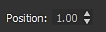
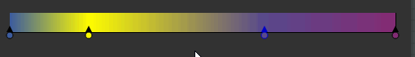
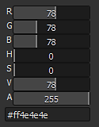

# 그레이디언트 맵

<table>
<tr style="border: 0;">
<td width="33.33%" style="border: 0;" valign="top">

{width="200px"}

</td>
<td width="100.00%" style="border: 0;" valign="top">

사용자 지정 그레이디언트를 사용하여 이미지의 회색조 값을 재매핑합니다.

이 노드는 두 가지 용도로 사용됩니다. 간단히 <b>(으)로 사용할 수 있습니다. </b>회색 음영-색상 변환 노드 또는 회색 음영 색상화를 위해 사용자 지정 색상 경사도에 매핑할 수 있습니다.

</td>
</tr>
</table>

이 노드에서는 여러 색상을 정밀하게 매핑할 수 있는 기능이 풍부한 고급 그레이디언트 편집기를 제공합니다. 자세히 알아보려면 이 페이지의 [그레이디언트 편집기](#gradient-editor) 섹션으로 이동하십시오.

<table>
<tr style="border: 0;">
<td width="100.00%" style="border: 0;" valign="top">

</td>
<td width="83.33%" style="border: 0;" valign="top">

</td>
<td width="100.00%" style="border: 0;" valign="top">

</td>
</tr>
</table>

## 예

## 매개변수

|  |  |
| --- | --- |
| <b>색상 모드</b> *부울* | 출력 모드를 [색상] 또는 [회색 음영]으로 설정합니다. |
| <b>그레이디언트 조정</b> *부울* | [0, 1] 범위를 벗어나는 반복(타일) 또는 클램프 값으로 그레이디언트를 설정합니다. |
| <b>그레이디언트</b> *그라디언트 키 배열* | 입력 회색 음영 값을 매핑하는 데 사용되는 사용자 정의 그라디언트 램프입니다.   현재 위치에서 편집하거나 [그레이디언트 편집기](#gradient-editor)를 사용하여 편집할 수 있습니다. |

## 그레이디언트 편집기

이 창에서는 회색 음영 값을 색상에 매핑하기 위해 그레이디언트 맵 노드에서 사용하는 참조 그레이디언트를 편집하는 컨트롤을 제공합니다.

그레이디언트 맵 노드의 <b>속성</b>에서 다음과 같은 방법으로 열 수 있습니다.

* <b>그레이디언트 편집기</b> 단추에서 LMB를 클릭합니다.
* 그레이디언트 막대의 핀에서 LMB 를 두 번 클릭합니다. 그러면 클릭한 핀의 값을 직접 편집할 수 있도록 그레이디언트 편집기에서 해당 핀이 자동으로 선택됩니다.

### 그레이디언트 핀 편집

그레이디언트를 따라 색상과 해당 위치는 그레이디언트 막대를 따라 배치된 핀에 의해 제어됩니다.

각 핀은 그레이디언트를 따라 해당 위치에 색상을 설정합니다.

첫 번째 핀과 마지막 핀 앞뒤에 있는 그라디언트 부분은 각각 해당 핀의 색상으로 설정됩니다.

핀 편집에 사용할 수 있는 컨트롤은 다음과 같습니다.

<table>
<tr style="border: 0;">
<td style="border: 0;" valign="top">

<b>핀 추가</b>

그레이디언트 또는 바로 아래에 있는 [LMB]를 클릭하여 그레이디언트 막대에서 클릭한 위치에 핀을 추가합니다.

새 핀은 해당 위치에서 그레이디언트의 색상으로 설정됩니다.

</td>
<td style="border: 0;" valign="top">

</td>
</tr>
</table>

<table>
<tr style="border: 0;">
<td style="border: 0;" valign="top">

<b>핀 이동</b>

LMB를 누른 상태에서 선택한 핀을 그레이디언트 막대를 따라 드래그하여 이동합니다.

핀을 선택하고 <b>Position</b> 매개 변수를 사용하여 숫자 값으로 그룹의 위치를 설정할 수도 있습니다. 위치는 [0;1] 범위의 값입니다. 여기서 0은 그레이디언트의 시작이고 1은 그레이디언트의 끝입니다.

</td>
<td style="border: 0;" valign="top">

</td>
</tr>
</table>

여러 핀을 선택하면 *동시에* 이동할 수 있습니다. 하나 이상의 핀이 이동할 때 그레이디언트의 끝과 닿는 경우, 이동에 사용한 마우스 버튼에 따라 다음 두 가지 비헤이비어를 사용할 수 있습니다.

* <b>LMB:</b> 핀은 끝에 남아 있습니다. 즉, 해당 위치에 도달하고 상대 위치가 변경되면 해당 위치에 쌓입니다.
* <b>MMB:</b> 핀은 그레이디언트의 다른 쪽 끝으로 다시 반복됩니다. 즉, 상대 위치가 변경되지 않았음을 의미합니다.

<table>
<tr style="border: 0;">
<td style="border: 0;" valign="top">

<b>핀 삭제</b>

핀을 선택하고 Delete 키를 누르거나 핀을 그레이디언트 막대 밖으로 드래그하여 삭제합니다.

</td>
<td style="border: 0;" valign="top">

</td>
</tr>
</table>

<table>
<tr style="border: 0;">
<td style="border: 0;" valign="top">

<b>위치 반전</b>

그레이디언트에서 선택한 핀의 위치를 미러링합니다.

</td>
<td style="border: 0;" valign="top">

</td>
</tr>
</table>

<table>
<tr style="border: 0;">
<td style="border: 0;" valign="top">

<b>모두 지우기</b>

그레이디언트 막대에서 모든 핀을 제거합니다.

</td>
<td style="border: 0;" valign="top">

</td>
</tr>
</table>

<b>색상 반전</b>

이 버튼은 선택한 핀의 색상을 음수로 전환합니다.

<b>채도 감소</b>

이 버튼은 선택한 핀에 설정된 색상의 채도를 낮춥니다.

### 보간 모드

핀을 설정한 후에는 사용 가능한 보간 모드를 사용하여 색상이 한 핀에서 다음 핀으로 전환하는 방법을 제어할 수 있습니다.

+++선형
기본 보간 모드: 각 핀 사이에 간단한 선형 보간을 적용하여 그레이디언트가 균일하게 진행되도록 합니다.

+++

+++평면 접선
핀이 곡선의 포인트인 경우 그레이디언트를 베지어 곡선으로 전환하려고 할 때 이 모드에서는 이러한 포인트가 수평 접선이 있도록 설정합니다.

그러면 매끄러운 단계 보간을 연상시키는 전환이 발생합니다.

이 모드를 선택하면 <b>중간점</b> 매개 변수가 활성화되고 점 사이의 곡선의 세로 중간점의 가로 위치를 오프셋할 수 있습니다. 그러면 접선 &#39;out&#39;과 &#39;in&#39; 사이의 비율에 도움이 됩니다.

+++

+++매끄럽게
각 점 사이의 보간 곡선에 매끄러움을 적용합니다.

이 모드를 선택하면 <b>Smoothness</b> 매개 변수가 활성화되고 0의 값이 <b>선형</b> 보간 모드와 같은 경우 매끄러움의 강도를 조정할 수 있습니다.

+++

+++보간 없음
색상은 핀의 위치에서만 변경되고, 그레이디언트 막대를 따라 다음 핀까지 일정하게 유지됩니다.

그러면 색상 간에 뚜렷한 차이가 나타나며 해당 핀이 설정한 색상만 그레이디언트에 나타납니다.

+++

### 색상 피커

[색상 피커]를 사용하면 다음과 같은 여러 가지 방법으로 색상을 설정할 수 있습니다.

* <b>그레이디언트 및 색조 막대</b>

  <table>
  <tr style="border: 0;">
  <td style="border: 0;" valign="top">

  그레이디언트의 기즈모와 색조 막대의 노치의 위치를 조정하여 색상을 설정합니다.

  </td>
  <td style="border: 0;" valign="top">

  

  </td>
  </tr>
  </table>

* <b>RGB, HSV 및 Alpha 슬라이더</b>

  <table>
  <tr style="border: 0;">
  <td width="100.00%" style="border: 0;" valign="top">

  RGB, HSV 및 Alpha 슬라이더를 사용하면 슬라이더를 조정하거나 해당 숫자 값을 직접 설정하여 색상을 정확하게 설정할 수 있습니다.

  또는 슬라이더 아래의 전용 입력 필드에서 hexcode를 사용합니다.

  </td>
  <td width="33.33%" style="border: 0;" valign="top">

  

  </td>
  </tr>
  </table>

* <b>화면에서 선택</b>

  <table>
  <tr style="border: 0;">
  <td style="border: 0;" valign="top">

  <b>선택</b> 단추를 사용하고 화면의 아무 곳이나 LMB를 클릭하여 해당 위치에서 색상을 샘플링합니다.

  </td>
  <td style="border: 0;" valign="top">

  

  </td>
  </tr>
  </table>

<table>
<tr style="border: 0;">
<td width="100.00%" style="border: 0;" valign="top">

선택한 색상은 색상 썸네일의 위쪽에 미리 표시됩니다.\
아래쪽 절반에는 이전에 사용한 색상이 표시됩니다. LMB를 더블 클릭하여 조정된 색상으로 되돌립니다.

</td>
<td width="16.67%" style="border: 0;" valign="top">

</td>
</tr>
</table>

여러 핀을 선택하면 RGB, HSV 및 Alpha 슬라이더가 델타(Δ) 슬라이더로 바뀝니다. 즉, 각 핀의 값을 동일한 양만큼 오프셋하는 데 사용됩니다.

<table>
<tr style="border: 0;">
<td width="100.00%" style="border: 0;" valign="top">

또한 색상 축소판 아래에서 버튼으로 사용할 수 있는 기능은 다음과 같습니다.

<b>반전:</b> 색상을 음수로 전환합니다.

<b>회색으로:</b> 색상의 채도를 낮춥니다.

<b>복사&#x200B;</b>*:* 현재 선택한 색상을 클립보드에 복사합니다.

<b>붙여넣기:</b> 현재 클립보드에 있는 색상으로 전환합니다.

<b>sRGB</b>: sRGB 색상 공간을 사용하여 색상을 표시합니다. 비활성화하면 선형 색상 공간이 사용됩니다.

<b>부동:</b> 부동 소수점에 RGB, HSV 및 Alpha 슬라이더 값을 표시합니다.

</td>
<td width="25.00%" style="border: 0;" valign="top">

</td>
</tr>
</table>

### 그레이디언트 스포이드

[그레이디언트 스포이드]는 참조 사진에 선을 그리는 것만으로도 복잡한 그레이디언트를 만들 수 있으므로 이 노드가 제공하는 가장 유용한 기능 중 하나입니다.

<b>정밀도</b> 슬라이더를 사용하면 키 수를 늘리거나 줄여 새로 만든 그레이디언트를 조정하는 데 도움이 됩니다. 해당 값이 낮을수록 선택한 값과 더 정확하게 일치합니다.

## 입력 커넥터

|  |  |
| --- | --- |
| <b>입력</b> *회색 음영* 기본 | 처리할 회색 음영 이미지. |

## 출력 커넥터

|  |  |
| --- | --- |
| <b>출력</b> *회색 음영* |  |

## 예

*곧 출시 예정*
