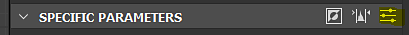

# 레벨

<table>
<tr style="border: 0;">
<td width="33.33%" style="border: 0;" valign="top">

{width="200px"}

</td>
<td width="100.00%" style="border: 0;" valign="top">

이미지의 어두운 영역, 중간 톤, 밝은 영역에 대한 전역 색조 범위와 색상 균형을 조정합니다.

[레벨] 노드를 사용하면 다른 2D 이미지 편집기에서 익숙한 막대 그래프 인터페이스에 표시되는 입력 및 출력 다시 매핑 요소를 설정하여 입력 톤을 다시 매핑할 수 있습니다.

</td>
</tr>
</table>

Substance 3D Designer에서 가장 유용한 핵심 노드 중 하나이며, 값 변경에 대해 가장 정확하고 정확한 인터페이스를 제공하기 때문에 그래프에서 값을 다시 매핑하고 조정하는 데 매우 자주 사용됩니다.

중요한 노드이지만 일부 사용 사례에서는 인터페이스가 약간 번거로울 수 있으므로 대안을 위해 [자동 수준](../../../../compositing-graphs/nodes-reference-for-com/node-library/filters/adjustments/auto-levels/auto-levels.md), [대비/광도](../../../../compositing-graphs/nodes-reference-for-com/node-library/filters/adjustments/contrast-luminosity/contrast-luminosity.md) 및 [막대 그래프 스캔](../../../../compositing-graphs/nodes-reference-for-com/node-library/filters/adjustments/histogram-scan/histogram-scan.md)을 살펴보십시오.

<table>
<tr style="border: 0;">
<td width="100.00%" style="border: 0;" valign="top">

</td>
<td width="83.33%" style="border: 0;" valign="top">

</td>
<td width="100.00%" style="border: 0;" valign="top">

</td>
</tr>
</table>

## 예

## 매개변수

이 노드에는 값을 조정할 수 있는 히스토그램과 슬라이더의 두 가지 인터페이스가 있습니다. &#39;특정 매개 변수&#39; 헤더 바의 맨 오른쪽 버튼을 사용하여 이 매개 변수 간에 전환할 수 있습니다.

<table>
<tr style="border: 0;">
<td width="100.00%" style="border: 0;" valign="top">

강조 표시된 노란색 버튼은 막대 그래프(위쪽) 값 슬라이더(아래쪽) 사이의 인터페이스를 전환합니다

</td>
<td width="66.67%" style="border: 0;" valign="top">

</td>
</tr>
</table>

|  |  |
| --- | --- |
| <b>낮은 수준</b> *Float/Float4* | 입력 이미지의 저조도 레벨을 정의합니다. 입력 [낮음] 값을 다시 매핑하여 전체 검정색이 됩니다. |
| <b>높은 수준</b> *Float/Float4* | 입력 이미지의 밝은 영역 레벨을 정의합니다.  입력 High 값을 전체 흰색으로 다시 매핑합니다. |
| <b>중간 수준</b> *Float/Float4* | 입력 이미지의 중간 영역 레벨을 정의합니다.  입력 Mid 값을 중간 회색으로 다시 매핑합니다. |
| <b>수평 아웃 낮음</b> *Float/Float4* | 출력 이미지의 저조도 레벨을 정의합니다.  제한을 설정하려면 출력 [검정] 값을 클램프합니다. |
| <b>수준 높음</b> *Float/Float4* | 출력 이미지의 밝은 영역 레벨을 정의합니다.  제한을 설정하려면 출력 흰색 값을 클램프합니다. |
| <b>중간 클램프</b> *부울* | 출력 레벨을 계산하기 전에 변환된 입력 값을 [0, 1]로 클램프할지 여부를 결정합니다. |

## 사용 안내서

[레벨] 노드 및 해당 막대 그래프 편집기에 대한 이 비디오 개요를 확인하십시오.

### 빠른 작업

&#39;특정 매개 변수&#39; 상단 표시줄에서 막대 그래프의 편리한 기능에 액세스하는 단추를 찾을 수 있습니다.

<b>1 - 반전:</b> &#39;Level out low&#39; 및 &#39;Level out high&#39; 매개 변수의 값을 바꿉니다.

<b>2 - 자동 수준:</b> &#39;Level in low&#39; 및 &#39;Level in high&#39; 매개 변수의 값을 각각 이미지에 있는 가장 낮은 값과 가장 높은 값으로 자동으로 조정합니다.

<b>3 - 인터페이스 전환:</b> 히스토그램과 슬라이더 편집기를 전환합니다.

### 히스토그램

막대 그래프 편집기는 정확한 값이 필요하지 않고 노출 매개 변수가 중요하지 않은 경우 시각적으로 빠르게 조정할 수 있도록 만들어졌습니다. 일반적으로 레벨 작업 시 가장 빠르고 쉬운 방법입니다.

입력 유형(색상 또는 회색 음영)에 따라 막대 그래프 위의 드롭다운을 사용하여 수정 중인 채널을 선택할 수 있습니다.

### 슬라이더

슬라이더 편집기는 시각적 편집기를 사용하지 않으며 수치 슬라이더만 제공합니다. 이는 슬라이더 편집기에서만 가능하므로 대부분 매우 정확한 값으로 클램프하거나 다시 매핑하거나 [이러한 매개 변수를 노출](../../../../compositing-graphs/manage-parameters/exposing-a-parameter/exposing-a-parameter.md)하려는 경우에 유용합니다.

색상 또는 회색 음영 입력에 따라 슬라이더가 변경됩니다. 색상 입력은 각 RGBA 채널에 대해 4개의 슬라이더를 개별적으로 생성하고, 회색 음영에는 슬라이더가 하나만 있어 쉽게 작업할 수 있습니다. 모든 슬라이더에 대한 설명은 위의 매개 변수 목록 을 참조하십시오.

## 입력 커넥터

|  |  |
| --- | --- |
| <b>입력</b> 기본 *회색 음영/색상* | 처리할 이미지. |

## 출력 커넥터

|  |  |
| --- | --- |
| <b>출력</b> *회색 음영/색상* |  |

## 예

*곧 출시 예정*
