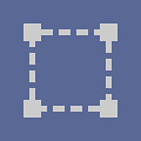

# 2D 변환

<table>
<tr style="border: 0;">
<td width="33.33%" style="border: 0;" valign="top">

{width="200px"}

</td>
<td width="100.00%" style="border: 0;" valign="top">

2D 변환 매트릭스를 이미지에 적용합니다(변환, 회전, 크기 조정, 대칭, 기울이기).

이는 Substance 3D Painter에서 변형(Ctrl-T)하거나 Photoshop에서 2D 매핑 조작기를 사용하는 것과 매우 유사합니다.

</td>
</tr>
</table>

이 노드는 매우 유용하고 널리 적용되는 노드로, 타일링 향상, 타일링 제거, 특정 위치에 이미지 배치, 입력 늘리기 또는 찌그러뜨리기 등을 수행할 수 있습니다.

그러나 특정 응용 프로그램과 완벽하게 일치할 수는 없으므로 다음 노드가 관심 있을 수 있습니다. [안전 변형](../../../../compositing-graphs/nodes-reference-for-com/node-library/filters/transforms/safe-transform/safe-transform.md), [정사각형이 아닌 변형](../../../../compositing-graphs/nodes-reference-for-com/node-library/filters/transforms/non-square-transform/non-square-transform.md), [쿼드 변형](../../../../compositing-graphs/nodes-reference-for-com/node-library/filters/transforms/quad-transform/quad-transform.md) 및 [사다리꼴 변형](../../../../compositing-graphs/nodes-reference-for-com/node-library/filters/transforms/trapezoid-transform/trapezoid-transform.md).

<table>
<tr style="border: 0;">
<td width="100.00%" style="border: 0;" valign="top">

</td>
<td width="83.33%" style="border: 0;" valign="top">

</td>
<td width="100.00%" style="border: 0;" valign="top">

</td>
</tr>
</table>

>[!TIP]
>
> 타일링 비활성화
> 
> &#39;타일링 모드&#39; [기본 매개 변수](../../../../glossary/glossary.md)의 [상속 메서드](../../../../glossary/glossary.md)를 &#39;절대&#39;로 설정한 다음 매개 변수 값을 &#39;타일링 없음&#39;으로 설정할 수 있습니다.
> 
> 

>[!NOTE]
>
> 노드 속성에서 배율 조정 및 회전 값은 *현재 변환에 상대적인 값*&#x200B;이며 &#39;적용&#39; 단추를 클릭하기 전까지 2D 보기에 적용되지 않습니다.

<table>
<tr style="border: 0;">
<td style="border: 0;" valign="top">

## 출력 커넥터

</td>
<td style="border: 0;" valign="top">

### 예

</td>
</tr>
</table>

## 매개변수

|  |  |
| --- | --- |
| <b>변환 행렬</b> *Float4* | 직접 편집을 위해 기본 매트릭스 변환을 엽니다. 회전 및 배율 조정을 변경할 수 있습니다. 2D 보기의 gizmo를 통해 조정할 수도 있습니다.   경고: 뷰와 직접 관련이 없으며 단계에 적용할 수 있는 상대 조정입니다. |
| <b>오프셋</b> *Float2* | 이미지의 2D 변위를 정의합니다. 위치 또는 오프셋을 변경할 수 있습니다. 또한 2D 뷰에서 gizmo를 통해 조정할 수 있습니다.   2D 뷰 출력과 직접 관련이 있습니다. |
| <b>맵 모드</b> *정수* | 수동 [mipmap](../../../../glossary/glossary.md) 수준으로 전환할 수 있습니다. 이 수준은 텍스처 필터링을 사용하여 이미지의 아티팩트를 줄입니다. |
| <b>밉맵 레벨</b> *정수* | 사용할 [mipmap](../../../../glossary/glossary.md) 수준을 설정합니다.     *Mipmap 모드가 &#39;수동&#39;으로 설정된 경우 사용 가능* |
| <b>매트 색상</b> *Float4* | 변형 타일링을 비활성화할 때 배경으로 사용되는 색상입니다. 즉, 변환된 입력이 출력의 영역을 커버하지 않을 때 사용되는 색상을 설정한다.   RGBA 색상으로 작업하는 경우 투명하게 만들 수 있습니다. |
| <b>필터링</b> *정수* | 사용된 다운샘플링 방법을 설정합니다. 밉맵 레벨이 감소하는 경우 특히 잘 작동하지 않습니다. |

## 입력 커넥터

|  |  |
| --- | --- |
| <b>입력</b> 기본 *회색 음영/색상* | 변환할 이미지입니다. |

## 출력 커넥터

|  |  |
| --- | --- |
| <b>출력</b> *회색 음영/색상* |  |

## 예

*곧 출시 예정*
