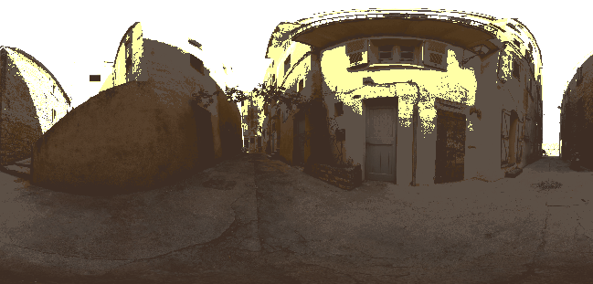

# Color Temperature Adjustment

<table>
<tr style="border: 0;">
<td style="border: 0;" valign="top">

{width="250px"}

## Color Temperature Adjustment

**내부:** *3D 보기/HDRI 도구*

**단순**

</td>
<td style="border: 0;" valign="top">

## 설명

입력 이미지의 색상 균형을 조정합니다. 사진의 흰색 균형 조정과 유사합니다. 키를 벗어난 HDR 이미지의 색상을 따뜻하게 하거나 차갑게 하는 데 사용할 수 있습니다.

## 매개변수

* **온도**: *-1.0 - 1.0*\
  따뜻한 색상과 차가운 색상 간에 색상을 이동합니다.
* **자홍색-녹색**: *-1.0 - 1.0*\
  자홍과 녹색 간 톤을 이동합니다.
* **색상 공간**: *HDR(선형), LDR(sRGB)*입력 이미지의 색상 공간을 해석하는 방법을 결정합니다.

## 예제 이미지

</td>
</tr>
</table>
