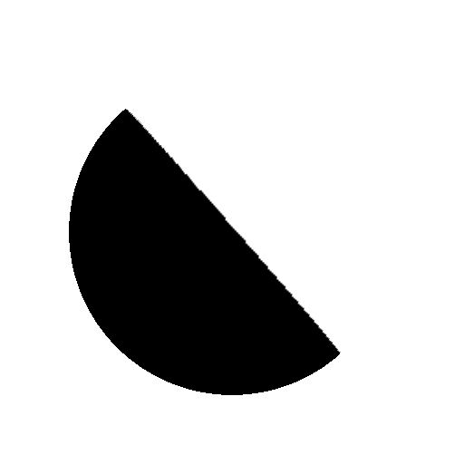

# 노출

<table>
<tr style="border: 0;">
<td width="33.33%" style="border: 0;" valign="top">

{width="250px"}

<b>내부:</b> 3D 보기 > HDRI 도구

</td>
<td width="100.00%" style="border: 0;" valign="top">

## 설명

입력 이미지의 노출을 조정합니다. 사진 편집 소프트웨어에서처럼 &quot;중지&quot; 값 개념을 사용하여 HDR 사진을 밝게 하거나 어둡게 합니다.

</td>
</tr>
</table>

## 매개변수

|  |  |
|:---|:---|
| <b>노출(EV)</b> <i>-8.0 - 8.0</i> | 노출 값, 중지점 |
