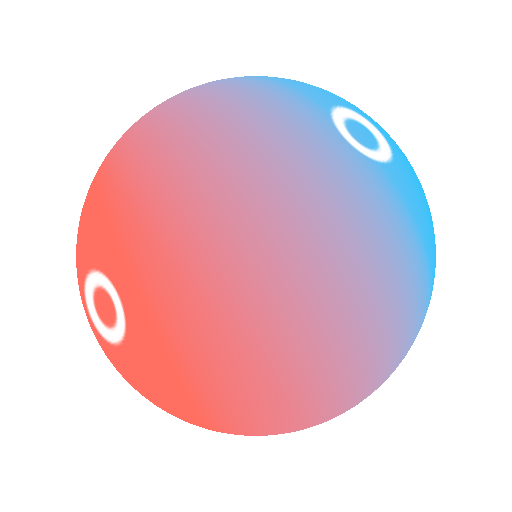

# 그레이디언트 2 포인트

<table>
<tr style="border: 0;">
<td width="33.33%" style="border: 0;" valign="top">

{width="250px"}

<b>내부:</b> 3D 보기 > HDRI 도구

</td>
<td width="100.00%" style="border: 0;" valign="top">

## 설명

사용자가 선택한 두 점 사이에 2가지 색상의 그레이디언트를 만듭니다. 구형 투영을 위해 결과가 조정됩니다. [HDRI(선형 그레이디언트)](../../../../../../compositing-graphs/nodes-reference-for-com/node-library/3d-view-library/hdri-tools/gradient-linear-hdri/gradient-linear-hdri.md)과(와) 유사하지만 1개가 아닌 2개의 점이 있습니다.

</td>
</tr>
</table>

## 매개변수

|  |  |
|:---|:---|
| <b>포인트 1 위치</b> | 사용자가 선택한 첫 번째 점 위치. 2D 보기 핸들이 있습니다. |
| <b>포인트 1 색상</b> <i>(색상 값)</i> | 그레이디언트 시작 시 색상 적용. |
| <b>포인트 1 대비</b> <i>0.0 - 1.0</i> | 첫 번째 점 마스크의 대비입니다. |
| <b>점 2 위치</b> | 사용자가 선택한 두 번째 점 위치 2D 보기 핸들이 있습니다. |
| <b>포인트 2 색상</b> <i>(색상 값)</i> | 그레이디언트 끝의 색상. |
| <b>점 2 대비</b> <i>0.0 - 1.0</i> | 두 번째 점 마스크의 대비입니다. |

## 예

<table style="margin-top: 32px; margin-bottom: 32px">
    <tr style="border: 0">
        <td style="border: 0; background: transparent">
            
        </td>
    </tr>
</table>
