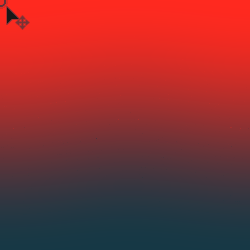

# 선형 그레이디언트(HDRI)

<table>
<tr style="border: 0;">
<td width="33.33%" style="border: 0;" valign="top">

{width="200px"}

<b>내부:</b> 3D 보기 > HDRI 도구

</td>
<td width="100.00%" style="border: 0;" valign="top">

## 설명

사용자가 놓은 점으로 중앙을 가로질러 [선형 그레이디언트]를 만듭니다. 일반 [그레이디언트 선형 1](../../../../../../compositing-graphs/nodes-reference-for-com/node-library/texture-generators/patterns/gradient-linear-1/gradient-linear-1.md)과 달리 구형 투영에 맞게 최종 결과가 조정됩니다.

</td>
</tr>
</table>

## 매개변수

|  |  |
|:---|:---|
| <b>포인트 위치</b> | 그레이디언트 방향을 결정하는 데 사용되는 색조의 위치입니다. |
| <b>위쪽 색상</b> <i>(색상 값)</i> | 그라디언트 위쪽 부분의 색상(지점) |
| <b>아래쪽 색상</b> <i>(색상 값)</i> | 그레이디언트 아랫부분의 색상(점에서 반대 방향). |
| <b>대비</b> <i>0.0 - 1.0</i> | 결과의 대비를 조정합니다. |

## 예

<table style="margin-top: 32px; margin-bottom: 32px">
    <tr style="border: 0">
        <td style="border: 0; background: transparent">
            
        </td>
    </tr>
</table>
