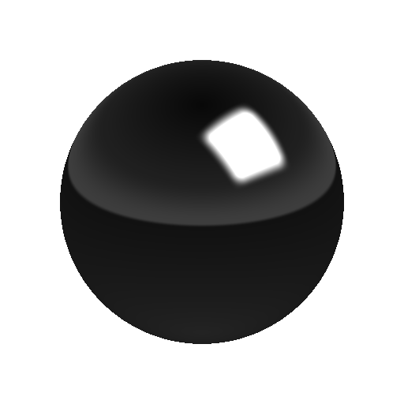

# 도형 조명

<table>
<tr style="border: 0;">
<td width="33.33%" style="border: 0;" valign="top">

{width="200px"}

<b>내부:</b> 3D 보기 > HDRI 도구

</td>
<td width="100.00%" style="border: 0;" valign="top">

## 설명

구형으로 투영된 직사각형 모양을 생성합니다. 모양 변형은 변형 기즈모 로 구동됩니다.

</td>
</tr>
</table>

## 입력

|  |  |
|:---|:---|
| <b>배경 이미지 입력</b> <i>색상 입력</i> | 생성된 빛을 구성할 선택적 배경입니다. |
| <b>모양 이미지 입력</b> <i>색상 입력</i> | 구체 조명에 매핑할 선택적 이미지입니다. [모양 색상 모드]가 [이미지 입력]으로 설정된 경우에만 사용됩니다. |

## 매개변수

|  |  |
|:---|:---|
| <b>모양 매트릭스</b> |  |
| <b>행렬</b> <i>(변환 행렬)</i> | 결과에 대한 변형 컨트롤입니다. 캔버스와 직접 상호 작용하여 결과를 수정할 수 있습니다. |
| <b>오프셋</b> <i>-2.0 - 2.0</i> | 결과를 이동하거나 변환합니다. 캔버스와 직접 상호 작용하여 결과를 수정할 수 있습니다. |
| <b>모양</b> <i>직사각형, 디스크</i> | 배치할 모양을 선택합니다. |
| <b>모양 색상 모드</b> <i>RGB, 온도(켈빈), 이미지 입력</i> | 모양 색상을 설정하는 데 사용할 방법을 선택합니다. 이미지 입력(Image Input)은 두 번째 입력 슬롯을 사용할 수 있게 합니다. |
| <b>색상</b> <i>(색상 값)</i> | [모양 색상 모드]가 [RGB]로 설정된 경우에만 가능합니다. 모양의 색상을 선택합니다. |
| <b>모양 온도</b> <i>800.0 - 20000.0</i> | [모양 색상 모드]가 [온도]로 설정된 경우에만 가능합니다. 모양 색상의 켈빈 값을 설정합니다. |
| <b>모양 이미지 입력 감마</b> <i>sRGB, 선형</i> | [모양 색상 모드]가 [이미지 입력]으로 설정된 경우에만 가능합니다. 모양 이미지 입력을 해석하는 방법을 결정합니다. |
| <b>모양 노출(EV)</b> <i>0.0 - 10.0</i> | 생성된 모양에 대한 노출 값 설정, 배경 이미지 노출 값과 이상적인 일치. |
| <b>모양 경도</b> <i>0.0 - 1.0</i> | 모양 가장자리의 경도를 설정합니다. |
| <b>핫스팟 노출(EV)</b> <i>0.0 - 10.0</i> | 중앙 핫스폿의 노출을 설정합니다. 참고: RGB 모드에서는 이 버튼이 잘 보이지 않습니다. |
| <b>핫스팟 크기</b> <i>0.0 - 1.0</i> | 중앙 핫스폿의 크기입니다. |
| <b>핫스폿 밝기 감소</b> <i>0.0 - 1.0</i> | 중앙 핫스폿의 밝기 감소. |
| <b>핫스팟 위치</b> <i>0.0 - 1.0</i> | 중앙 핫스폿의 X 및 Y 위치 |
| <b>배경 입력 사용</b> <i>거짓/참</i> | 선택적 배경 이미지 사용을 전환합니다. 합성 이미지에서 배경 상단에 조명이 생성되었습니다. |
| <b>배경색</b> <i>(색상 값)</i> | [배경 입력]을 사용하지 않는 경우에는 여기에서 단색 배경 값을 설정합니다. |
| <b>배경 감마</b> <i>sRGB, 선형</i> | [배경 입력]을 사용하는 경우 배경 입력을 해석하는 방법을 설정합니다. |

## 예

<table style="margin-top: 32px; margin-bottom: 32px">
    <tr style="border: 0">
        <td style="border: 0; background: transparent">
            
        </td>
    </tr>
</table>
