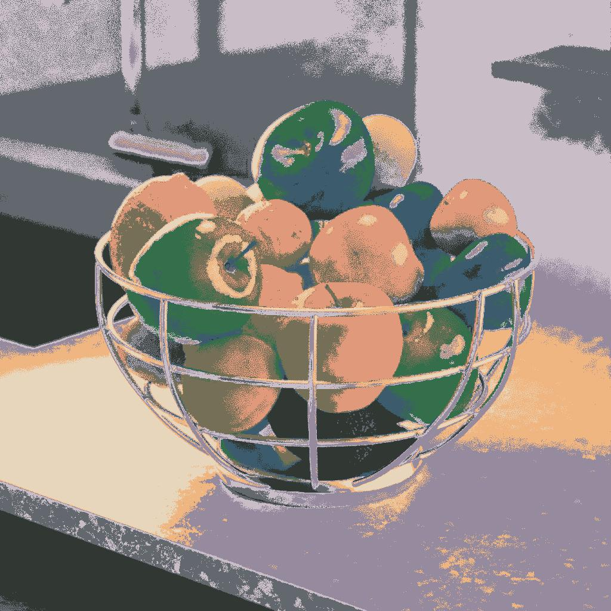

# 색상 팔레트 적용

<table>
<tr style="border: 0;">
<td width="33.33%" style="border: 0;" valign="top">

{width="200px"}

<b>내부:</b> 필터 > 조정

</td>
<td width="100.00%" style="border: 0;" valign="top">

## 설명

ID 맵을 사용하여 정렬된 팔레트의 색상을 이미지에 적용합니다.

색상은 ID 맵의 색인을 팔레트의 색상 색인과 일치시켜 분배됩니다.

예를 들어 팔레트의 색상 #2은 ID 값이 2인 ID 맵의 모든 픽셀에 적용됩니다.

이 노드는 다음 노드와 함께 사용할 수 있습니다. [색상 수량화](../../../../../../compositing-graphs/nodes-reference-for-com/node-library/filters/adjustments/quantize-color/quantize-color.md), [색상 팔레트 만들기](../../../../../../compositing-graphs/nodes-reference-for-com/node-library/filters/adjustments/create-color-palette-16/create-color-palette-16.md), [색상 팔레트 수정](../../../../../../compositing-graphs/nodes-reference-for-com/node-library/filters/adjustments/modify-color-palette/modify-color-palette.md), [색상 팔레트 보기](../../../../../../compositing-graphs/nodes-reference-for-com/node-library/filters/adjustments/view-color-palette/view-color-palette.md).

</td>
</tr>
</table>

<table>
<tr style="border: 0;">
<td style="border: 0;" valign="top">

</td>
<td style="border: 0;" valign="top">

### 출력 커넥터

</td>
<td style="border: 0;" valign="top">

</td>
</tr>
</table>

## 입력 커넥터

|  |  |
| --- | --- |
| <b>ID</b> *회색 음영* 기본 | 입력 팔레트의 색상을 분배하는 데 사용되는 입력 ID 맵입니다.   ID 맵은 전체(예를 들어, 모양)의 일부인 픽셀들이 모두 동일한 고유 식별 값을 갖는 이미지이다. 이 경우 값은 정수입니다.   [색상 정량화](../../../../../../compositing-graphs/nodes-reference-for-com/node-library/filters/adjustments/quantize-color/quantize-color.md) 노드를 사용하여 ID 맵을 생성할 수 있습니다. |
| <b>팔레트</b> *색상* | 픽셀 행으로 인코딩된 RGB 색상의 순서가 지정된 목록입니다. 팔레트에는 최대 256개의 색상을 사용할 수 있습니다. 노드가 ID 맵의 인덱스에 매핑되는 팔레트입니다.   팔레트는 [색상 정량화](../../../../../../compositing-graphs/nodes-reference-for-com/node-library/filters/adjustments/quantize-color/quantize-color.md) 노드로 만들어지고 [색상 팔레트 수정](../../../../../../compositing-graphs/nodes-reference-for-com/node-library/filters/adjustments/modify-color-palette/modify-color-palette.md) 노드로 수정될 수 있습니다. |

## 출력 커넥터

|  |  |
| --- | --- |
| <b>출력</b> *색상* | 팔레트의 색상을 ID 맵의 색인에 매핑한 결과입니다. |

## 예

{zoomable="yes"}

<table>
  <tr>
    <td>
      
       <i>이전</i>
    </td>
    <td>
      
       <i>이후</i>
    </td>
  </tr>
</table>

{zoomable="yes"}

<table>
  <tr>
    <td>
      
       <i>이전</i>
    </td>
    <td>
      
       <i>이후</i>
    </td>
  </tr>
</table>
