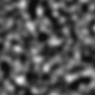

# 고정

<table>
<tr style="border: 0;">
<td width="33.33%" style="border: 0;" valign="top">

{width="128px"}

{width="128px"}

<b>내부:</b> 필터 > 조정

</td>
<td width="100.00%" style="border: 0;" valign="top">

## 설명

입력 값을 정의된 한도로 클램프합니다.

</td>
</tr>
</table>

## 매개변수

|  |  |
|:---|:---|
| <b>분</b> <i>0.0 - 1.0</i> | 클램프 한도를 낮춥니다. |
| <b>최대</b> <i>0.0 - 1.0</i> | 상한 클램프 한계. |
| <b>Alpha에 적용</b> <i>False/True</i>(색상 버전만) | 알파에도 클램핑이 적용되는지 여부를 선택합니다. |

## 예

<table style="margin-top: 32px; margin-bottom: 32px">
    <tr style="border: 0">
        <td style="border: 0; background: transparent">
            
        </td>
    </tr>
</table>
