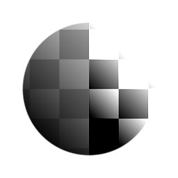

# 대비/광도

<table>
<tr style="border: 0;">
<td width="33.33%" style="border: 0;" valign="top">

{width="128px"}

{width="128px"}

<b>내부:</b> 필터 > 조정

</td>
<td width="100.00%" style="border: 0;" valign="top">

## 설명

간단한 대비와 광도(밝기) 조정입니다.

</td>
</tr>
</table>

## 매개변수

|  |  |
|:---|:---|
| <b>대비</b> <i>-1.0 - 1.0</i> | 결과의 대비를 조정합니다. |
| <b>광도</b> <i>-1.0 - 1.0</i> | 결과의 광도(밝기)를 조정합니다. |

## 예

<table style="margin-top: 32px; margin-bottom: 32px">
    <tr style="border: 0">
        <td style="border: 0; background: transparent">
            
        </td>
    </tr>
</table>
