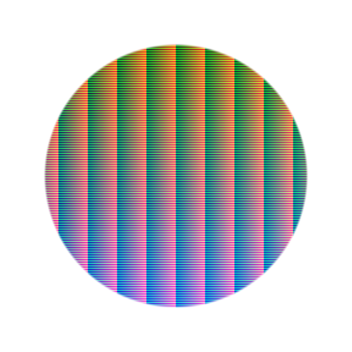

# 할드 클루트

<table>
<tr style="border: 0;">
<td width="33.33%" style="border: 0;" valign="top">

{width="128px"}

<b>내부:</b> 필터 > 조정

</td>
<td width="100.00%" style="border: 0;" valign="top">

## 설명

입력 이미지에 LUT를 적용합니다. LUT는 4096\*4096 해상도에서 Hald 형식이어야 합니다. 자세한 내용은 <http://www.quelsolaar.com/technology/clut.html>을(를) 참조하십시오.

</td>
</tr>
</table>

## 입력

|  |  |
|:---|:---|
| <b>입력</b> <i>색상 입력</i> | LUT를 적용할 이미지입니다. |
| <b>lut</b> <i>색상 입력</i> | Lut 입력 슬롯입니다. 4096x4096이어야 합니다. |

## 매개변수

|  |  |
|:---|:---|
| <b>Alpha별 LUT 강도</b> <i>거짓/참</i> | LUT 효과가 알파 채널에 의해 가중되는지 여부를 정의합니다. |

## 예

<table style="margin-top: 32px; margin-bottom: 32px">
    <tr style="border: 0">
        <td style="border: 0; background: transparent">
            
        </td>
    </tr>
</table>
