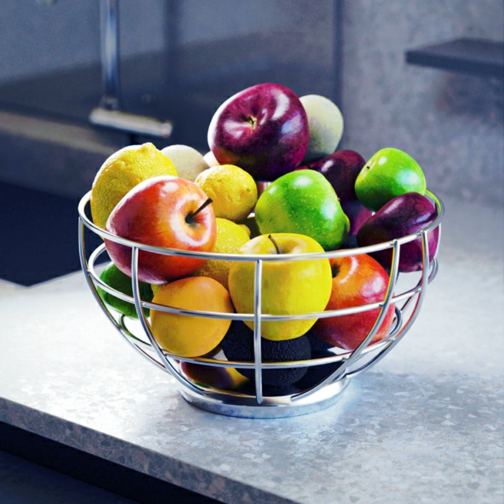

# 막대 그래프 균일화

<table>
<tr style="border: 0;">
<td width="33.33%" style="border: 0;" valign="top">

{width="200px"}

<b>내부:</b> 필터 > 조정

</td>
<td width="100.00%" style="border: 0;" valign="top">

## 설명

회색 음영 이미지에 대한 막대 그래프를 균일화하여 동일한 분포를 목표로 회색 음영 값을 효과적으로 조정합니다.

</td>
</tr>
</table>

## 입력

|  |  |
|:---|:---|
| <b>입력</b> <i>회색 음영</i> 기본 | 막대 그래프를 균일화할 이미지입니다. |

## 출력

|  |  |
|:---|:---|
| <b>출력</b> <i>회색 음영</i> | 막대 그래프 균일화가 적용된 결과 이미지. |

## 매개변수

|  |  |
|:---|:---|
| <b>막대 그래프 해상도</b> *정수* | 막대 그래프의 폭입니다. 값이 높을수록 더 세밀한 값 배포가 가능합니다.   사용 가능한 해상도는 픽셀 단위로 256, 512, 1024, 2048, 4096입니다. |
| <b>막대 그래프 매끄럽게</b> *부동* | 이미지의 회색 음영 값을 재분포하여 각 값 간의 *차이*&#x200B;를 균일화하여 막대 그래프를 다듬을 수 있습니다.   이 매개 변수는 보정 강도를 조정합니다. |

## 예

<table>
  <tr>
    <td>
      
       <i>이전</i>
    </td>
    <td>
      
       <i>이후</i>
    </td>
  </tr>
</table>

{zoomable="yes"}

<table>
  <tr>
    <td>
      
       <i>이전</i>
    </td>
    <td>
      
       <i>이후</i>
    </td>
  </tr>
</table>

{zoomable="yes"}

<table>
  <tr>
    <td>
      
       <i>이전</i>
    </td>
    <td>
      
       <i>이후</i>
    </td>
  </tr>
</table>

{zoomable="yes"}
