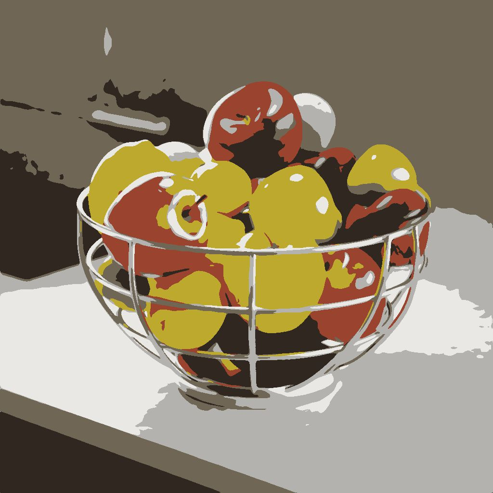

# 회색 음영 마스크 ID

<table>
<tr style="border: 0;">
<td width="33.33%" style="border: 0;" valign="top">

{width="200px"}

<b>내부:</b> 필터 > 조정

</td>
<td width="100.00%" style="border: 0;" valign="top">

## 설명

선택한 픽셀 값을 가진 픽셀이 흰색인 ID 맵에서 마스크를 만듭니다.

ID 맵은 전체(예를 들어, 모양)의 일부인 픽셀들이 모두 동일한 고유 식별 값을 갖는 이미지이다. 이 경우 값은 정수입니다.

</td>
</tr>
</table>

<table>
<tr style="border: 0;">
<td style="border: 0;" valign="top">

</td>
<td style="border: 0;" valign="top">

### 출력 커넥터

</td>
<td style="border: 0;" valign="top">

### 매개변수

</td>
</tr>
</table>

## 입력 커넥터

|  |  |
| --- | --- |
| <b>ID</b> *회색 음영* 기본 | 마스크를 추출해야 하는 입력 ID 맵입니다. |

## 출력 커넥터

|  |  |
| --- | --- |
| <b>출력</b> *회색 음영* | 입력 ID 맵에서 추출한 이진 마스크입니다. |

## 매개변수

|  |  |
| --- | --- |
| <b>선택 모드</b> *정수* | ID 맵에서 마스크에서 흰색으로 표시되어야 하는 픽셀 값을 선택하는 방법:<ul data-preserve-html="true"> <li data-preserve-html="true"><b>솔로:</b> 단일 픽셀 값 선택</li> <li data-preserve-html="true"><b>범위:</b> 픽셀 값의 범위를 선택합니다.</li> </ul> |
| <b>ID 정수</b> *정수* *&#39;선택 모드&#39;가 &#39;솔로&#39;로 설정된 경우 사용 가능* | ID 맵의 픽셀 값으로, 출력 마스크에서 흰색이어야 합니다. |
| <b>ID 범위</b> *Integer2* *&#39;선택 모드&#39;가 &#39;범위&#39;로 설정된 경우 사용 가능* | ID 맵의 시작부터 끝까지 픽셀 값의 범위입니다. 픽셀값은 출력 마스크에서 흰색이어야 합니다. |

## 예

<table>
  <tr>
    <td>
      
       <i>이전</i>
    </td>
    <td>
      
       <i>이후</i>
    </td>
  </tr>
</table>

<table>
<tr style="border: 0;">
<td style="border: 0;" valign="top">

{zoomable="yes"}

</td>
<td style="border: 0;" valign="top">

{zoomable="yes"}

</td>
</tr>
</table>
