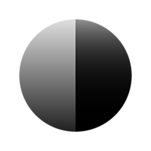

# Pow

<table>
<tr style="border: 0;">
<td style="border: 0;" valign="top">

{width="128px"}

{width="128px"}

## 펑(회색 음영)

**내부:** *필터/조정*

**단순**

</td>
<td style="border: 0;" valign="top">

## 설명

지정한 지수로 입력을 출력합니다. [수준](../../../../../../compositing-graphs/nodes-reference-for-com/atomic-nodes/levels/levels.md)중간점 조정과 비슷하지만 보다 간단한 패키지로 조정됩니다. 정확한 수학적 연산을 수행하려는 경우에도 유용합니다.

중요: [색상] 또는 [회색 음영] 입력 여부에 따라 올바른 버전을 사용해야 합니다.

## 매개변수

* **지수**: *0.0 - 10.0*&#x200B;지수로 입력 전원을 공급합니다.

## 예제 이미지

</td>
</tr>
</table>
