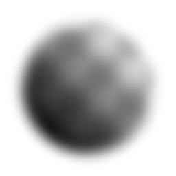

# 흐림 효과 HQ

<table>
<tr style="border: 0;">
<td width="33.33%" style="border: 0;" valign="top">

{width="128px"}

{width="128px"}

<b>인:</b> 필터 > 흐림 효과

</td>
<td width="100.00%" style="border: 0;" valign="top">

## 설명

결과에 고품질 가우시안 흐림 효과를 적용합니다. [표준 원자 상자 흐림 효과](../../../../../../compositing-graphs/nodes-reference-for-com/atomic-nodes/blur/blur.md)보다 훨씬 좋은 품질

중요: 입력에 적합한 버전을 사용해야 합니다. 색상 입력에는 &quot;Blur HQ&quot;를 사용하고 회색 음영 입력에는 &quot;Blur HQ Grayscale&quot;을 사용합니다.

</td>
</tr>
</table>

## 매개변수

|  |  |
|:---|:---|
| <b>강도</b> <i>0.0 - 16.0</i> | 흐림 효과의 강도(반경)입니다. 이 값이 높을수록 흐림 효과가 더 적용됩니다. |
| <b>품질</b> <i>0 - 1</i> | 더 높은 품질의 낮은 계산 속도에서 내부 샘플링 양을 증가시킵니다. |

## 예

<table style="margin-top: 32px; margin-bottom: 32px">
    <tr style="border: 0">
        <td style="border: 0; background: transparent">
            
        </td>
    </tr>
</table>
