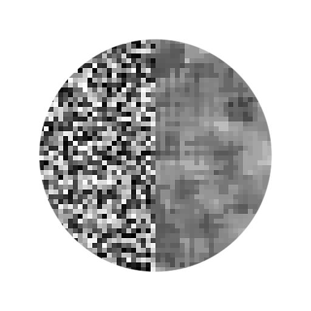
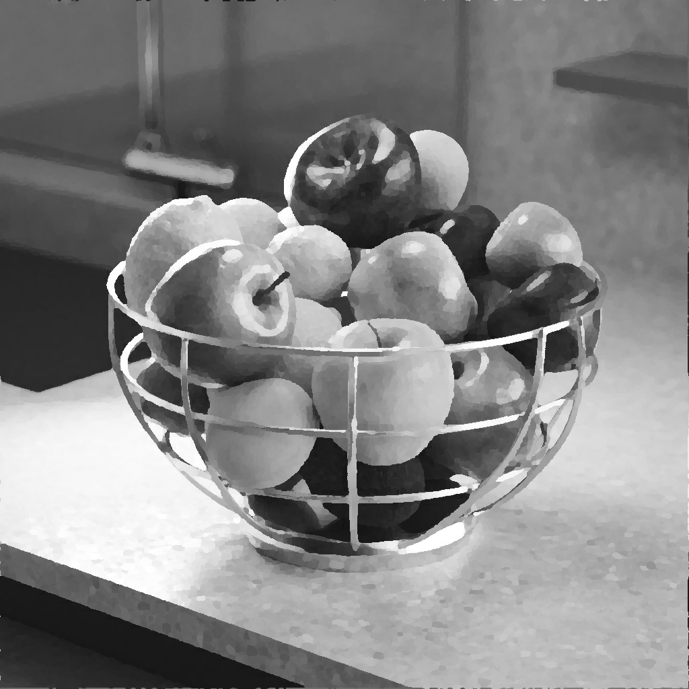

# 중간 필터 회색 음영

<table>
<tr style="border: 0;">
<td width="33.33%" style="border: 0;" valign="top">

<b>인:</b> 필터 > 흐림 효과

</td>
<td width="100.00%" style="border: 0;" valign="top">

## 설명

이 필터는 가장자리를 유지하면서 이미지의 노이즈를 부드럽게 합니다.

모든 픽셀에 대해 노드는 픽셀 이웃의 중간값에 따라 회색 음영 값을 계산한다.

</td>
</tr>
</table>

>[!NOTE]
>
> [중간 필터 색상](../../../../../../compositing-graphs/nodes-reference-for-com/node-library/filters/blurs/median-filter-color/median-filter-color.md)도 참조하세요.

## 입력 커넥터

<b>입력 </b>*회색 음영*&#x200B;필터를 적용해야 하는 회색 음영 이미지입니다.

## 출력 커넥터

<b>출력&#x200B;</b>*회색 음영*&#x200B;입력 회색 음영 이미지에 필터를 적용하여 계산한 회색 음영 이미지입니다.

## 매개변수

<b>커널 크기</b> *정수*&#x200B;커널은 필터의 계산에 사용되는 특정 값 그룹입니다. 이러한 맥락에서 인접 픽셀의 값입니다.\
모든 픽셀에 대해 이 필터는 사각형 커널에서 해당 픽셀 주위의 모든 이웃을 가져와서 모든 이웃의 중간값을 계산합니다.\
이 매개 변수는 해당 정사각형 커널의 크기를 픽셀 단위로 제어합니다. 커널이 클수록 더 세밀한 부분까지 더 강력하고 더 멀리 미치는 스무딩 효과를 얻을 수 있습니다.\
*- 3x3:* 커널의 너비가 3픽셀이고 높이가 3픽셀이며, 주변 픽셀은 총 8개입니다.\
*- 5x5:* 커널의 너비가 5픽셀이고 높이가 5픽셀이며, 주변 픽셀은 총 24개입니다.

<b>필터 유형</b> *정수*&#x200B;커널에서 샘플링된 인접 라우터에 적용된 계산입니다.\
*- 중간값:* 모든 인접 영역의 중간값을 직접 사용합니다.\
*- MLMAD:*&#x200B;은 &#39;최소 중간값 절대 편차의 중간값&#39;을 나타냅니다. 편차는 값이 중앙값과 얼마나 다른지 설명합니다. MLMAD 방법은 편차가 높은 이상치 픽셀에 의해 기울어질 수 있는 중간값을 직접 사용하는 대신 모든 편차의 중간값을 사용한다. 이 방법은 커널 크기에 따라 영역들을 평평평하게 할 수 있는 더 강한 평활화 효과를 초래한다.

## 예

<table>
  <tr>
    <td>
      
       <i>이전</i>
    </td>
    <td>
      
       <i>이후</i>
    </td>
  </tr>
</table>

<table>
  <tr>
    <td>
      
       <i>이전</i>
    </td>
    <td>
      
       <i>이후</i>
    </td>
  </tr>
</table>

<table>
  <tr>
    <td>
      
       <i>이전</i>
    </td>
    <td>
      
       <i>이후</i>
    </td>
  </tr>
</table>
