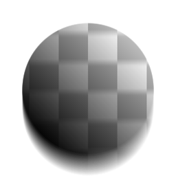

# 경사 흐림

<table>
<tr style="border: 0;">
<td style="border: 0;" valign="top">

{width="128px"}

{width="128px"}

## 경사 흐림 효과(회색 음영)

**내부:** *필터/흐림 효과*

**중간**

</td>
<td style="border: 0;" valign="top">

## 설명

회색 음영 &quot;경사 맵&quot;으로 비등방성/방향을 제어하는 고급 고품질 흐림 효과를 수행합니다. [방향 비틀기](../../../../../../compositing-graphs/nodes-reference-for-com/atomic-nodes/directional-warp/directional-warp.md)(내부적으로 기반)과 유사하게 경사 맵의 경사를 따라 [경사 흐림] 효과로 그립니다.

이는 Designer에서 가장 흥미롭고 강력한 흐림 효과 중 하나입니다. 이 효과는 가장자리를 깎고 풍화시키거나 Dirt 또는 녹을 번지거나 누출시키는 등의 매우 흥미롭고 예기치 않은 효과를 만드는 데 사용할 수 있습니다.

중요: 입력에 적합한 버전을 사용해야 합니다. 색상 입력에는 &quot;경사 흐림 효과&quot;를 사용하고 회색 음영 입력에는 &quot;경사 흐림 효과 회색 음영&quot;을 사용합니다.

## 매개변수

### 입력

* **경사**: *회색 음영 입력*&#x200B;비등방성의 구동 각도에 대한 경사 맵. 이 경우 경사가 있는 그레이디언트를 포함하는 것이 좋습니다. 거칠고 선명한 전환은 잘 작동하지 않습니다.

### 매개변수

* **샘플**: *0 - 32*&#x200B;샘플 양이 속도에 비해 품질에 영향을 줍니다.
* **강도**: *0.0 - 16.0*\
  흐림 효과 양 또는 강도.
* **모드**: *흐림, 최소, 최대*|\
  연속 흐림 효과의 혼합 모드. &quot;흐림 효과&quot;는 표준 [비등방성 흐림 효과](../../../../../../compositing-graphs/nodes-reference-for-com/node-library/filters/blurs/anisotropic-blur/anisotropic-blur.md)와 더 비슷하게 작동하지만, Min은 기존 영역을 &quot;먹어 치울&quot; 것이고 Max는 흰색 영역을 &quot;도말&quot;합니다.

## 예제 이미지

</td>
</tr>
</table>
