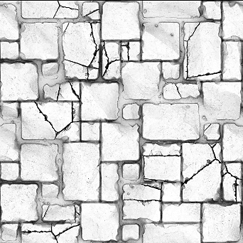

# 주변 오클루전(RTAO)

<table>
<tr style="border: 0;">
<td width="33.33%" style="border: 0;" valign="top">

<b>인:</b> 필터 > 효과

</td>
<td width="100.00%" style="border: 0;" valign="top">

## 설명

Height 맵 입력을 기반으로 앰비언트 오클루전 맵을 생성합니다.

이 필터는 HBAO에 비해 더 정확한 결과를 제공하지만 계산 시간 때문에 CPU (SSE) 엔진과 함께 사용해서는 안 됩니다.

더 빠르고 간단한 대안은 [주변 오클루전(HBAO)(필터 노드)](../../../../../../compositing-graphs/nodes-reference-for-com/node-library/filters/effects/ambient-occlusion-hbao/ambient-occlusion-hbao-filter-node.md)을 참조하십시오.

</td>
</tr>
</table>

## 매개변수

|  |  |
|:---|:---|
| <b>물리적 크기 사용</b> <i>부울</i> | 물리적 크기 설정을 사용하여 Height 비율을 결정하려면 전환합니다. |
| <b>물리적 크기</b> <i>Float3</i> <i>(<b>물리적 크기 사용</b>이 <i>참</i>(으)로 설정된 경우 사용 가능)</i> | 표면의 실제 Height을 기반으로 물리적 크기 비율을 조정합니다 |
| <b>샘플</b> <i>정수</i> | 앰비언트 오클루전을 계산하는 데 사용되는 광선 수입니다. 값이 높을수록 성능이 저하되므로 더 부드럽고 정확한 결과를 얻을 수 있습니다. |
| <b>Height 크기</b> <i>부동</i> <i>(<b>물리적 크기 사용</b>이 <i>거짓</i>(으)로 설정된 경우 사용 가능)</i> | Height 맵 입력 강도에 대한 승수입니다. |
| <b>배포</b> <i>정수</i> | 배포 방법을 설정합니다. 그림자가 있는 영역을 향해 감소합니다. |
| <b>최대 거리</b> <i>부동</i> | 폐색될 수 있는 최대 거리 광선을 설정합니다. |
| <b>스프레드 각도</b> <i>부동</i> | 주사할 광선의 확산 각도를 설정합니다. 1의 값은 완전한 반구입니다. |

## 예

<table style="margin-top: 32px; margin-bottom: 32px">
    <tr style="border: 0">
        <td style="border: 0; background: transparent">
            
        </td>
        <td style="border: 0; background: transparent">
            
        </td>
    </tr>
</table>
