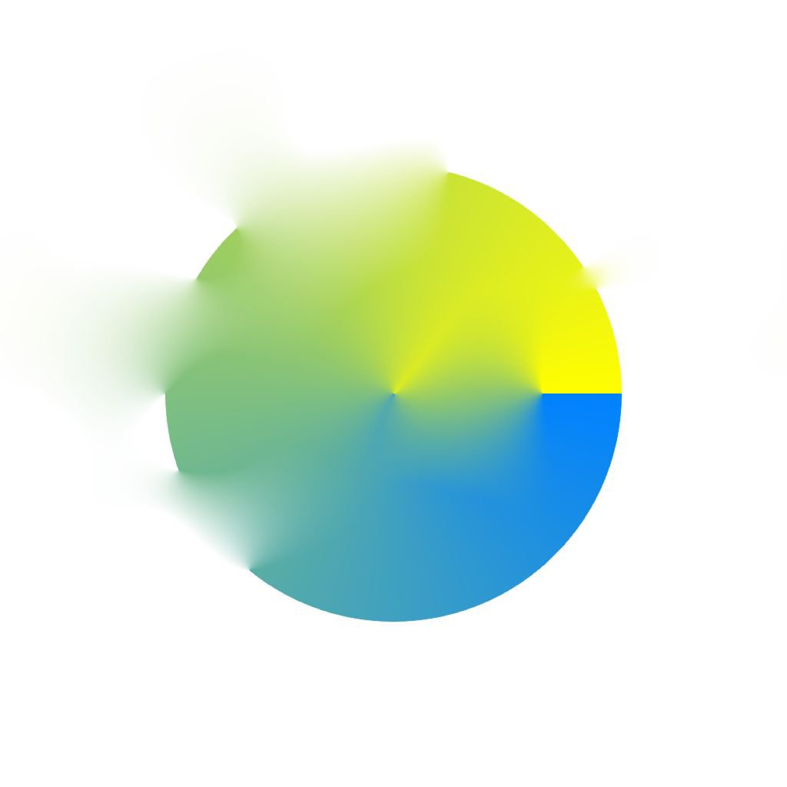

# 확산 색상

<table>
<tr style="border: 0;">
<td width="41.60%" style="border: 0;" valign="top">

{width="200px"}

**내부:** *필터/효과*

**중간**

</td>
<td width="58.30%" style="border: 0;" valign="top">

## 설명

제공된 **마스크** 이미지 입력에 따라 **소스** 이미지 입력의 색상에 확산 프로세스를 적용하여 [Substance 3D Designer](https://www.adobe.com/kr/products/substance3d-designer.html)을(를) 사용할 때 색상 간 매끄러운 그레이디언트를 만듭니다.

마스크와 일치하는 픽셀의 색상만 확산되고 다른 픽셀은 결과에 참여하지 않습니다.

</td>
</tr>
</table>

## 매개변수

* **반복**: *0.0 - 64.0*&#x200B;수행할 확산 반복 수입니다(높을수록 좋지만 느림). 유용한 값은 [8, 48] 범위에 있습니다.\
  만약 여러분이 수학적 정확성을 찾고 있지 않다면, 낮은 값들이 괜찮거나 더 낫다는 것을 알아두세요.\
  **거리**: **0.0 - 1.0**&#x200B;확산의 최대 거리를 조정합니다.
* **디더링 사용**: *참/거짓*&#x200B;각 패스의 샘플링 방법을 제어합니다. 디더링을 사용하면 패스가 줄어들지만 노이즈가 발생합니다.\
  이를 사용하지 않으면 각 가공 패스가 더 빨라지지만 밴딩 아티팩트 없이 매끄러운 결과를 얻기 위해서는 더 많은 가공 패스가 필요합니다.
* **표준 맵**: *참/거짓*&#x200B;단계마다 값에 정규화를 추가합니다.
* **Alpha을 마스크로 사용**: *참/거짓**마스크* 입력 대신 *소스* 입력의 알파 채널을 확산 마스크로 사용합니다.

## 입력

* **원본** *색상*\
  확산할 이미지입니다.
* **마스크** *회색 음영*\
  확산 마스크: *소스*&#x200B;에서 흰색 픽셀을 샘플링하고 검은색 픽셀에서 확산합니다. 이미지는 흑백이어야 합니다. 마스크에 그레이디언트가 포함되어 있으면 차단 값은 0.5입니다.
* **강도** *회색 음영*\
  확산 프로세스가 적용되는 강도를 로컬로 정의합니다. 이 지도는 눈에 띄는 효과를 위해 *대비*&#x200B;해야 합니다.

## 예제 이미지

<table>
<tr style="border: 0;">
<td style="border: 0;" valign="top">

{width="256px"}

</td>
<td style="border: 0;" valign="top">

{width="256px"}

</td>
<td style="border: 0;" valign="top">

{width="256px"}

</td>
</tr>
</table>

<table>
<tr style="border: 0;">
<td style="border: 0;" valign="top">

{width="256px"}

</td>
<td style="border: 0;" valign="top">

{width="256px"}

</td>
<td style="border: 0;" valign="top">

{width="256px"}

</td>
</tr>
</table>

<table>
<tr style="border: 0;">
<td style="border: 0;" valign="top">

{width="256px"}

</td>
<td style="border: 0;" valign="top">

{width="512px"}

</td>
</tr>
</table>
