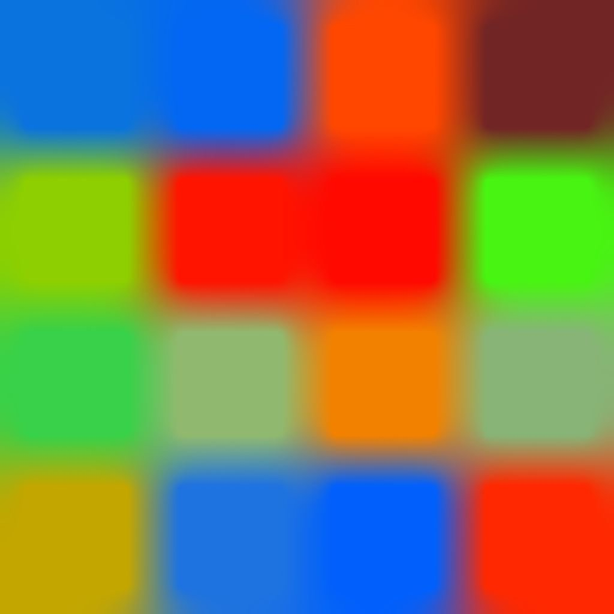

# 확산 색상

<table>
<tr style="border: 0;">
<td width="33.33%" style="border: 0;" valign="top">

{width="200px"}

<b>인:</b> 필터 > 효과

</td>
<td width="100.00%" style="border: 0;" valign="top">

## 설명

제공된 **마스크** 이미지 입력에 따라 **소스** 이미지 입력의 색상에 확산 프로세스를 적용하여 [Substance 3D Designer](https://www.adobe.com/kr/products/substance3d-designer.html)을(를) 사용할 때 색상 간 매끄러운 그레이디언트를 만듭니다.

마스크와 일치하는 픽셀의 색상만 확산되고 다른 픽셀은 결과에 참여하지 않습니다.

</td>
</tr>
</table>

## 입력

|  |  |
|:---|:---|
| <b>원본</b> <i>색상</i> | 확산할 이미지입니다. |
| <b>마스크</b> <i>회색 음영</i> | 확산 마스크: <i>소스</i>에서 흰색 픽셀을 샘플링하고 검은색 픽셀에서 확산합니다. 이미지는 흑백이어야 합니다. 마스크에 그레이디언트가 포함되어 있으면 차단 값은 0.5입니다. |
| <b>강도</b> <i>회색 음영</i> | 확산 프로세스가 적용되는 강도를 로컬로 정의합니다. 이 지도는 눈에 띄는 효과를 위해 <i>대비</i>해야 합니다. |

## 매개변수

|  |  |
|:---|:---|
| <b>반복</b> <i>0.0 - 64.0</i> | 수행할 확산 반복 수입니다(높을수록 좋지만 느림). 유용한 값은 [8, 48] 범위에 있습니다. 수학적 정확성을 찾고 있지 않은 경우 낮은 값이 적합하거나 더 좋습니다. |
| <b>거리</b> <i>0.0 - 1.0</i> | 확산의 최대 거리를 조정합니다. |
| <b>디더링 사용</b> <i>참/거짓</i> | 각 패스의 샘플링 방법을 제어합니다. 디더링을 사용하면 패스가 줄어들지만 노이즈가 발생합니다. 패스를 사용하지 않으면 각 패스가 더 빨라지지만 아티팩트 밴딩 없이 매끄러운 결과를 얻으려면 더 많은 패스가 필요합니다. |
| <b>노멀 맵</b> <i>참/거짓</i> | 모든 단계에서 값에 정규화를 추가합니다. |
| <b>Alpha을 마스크로 사용</b> <i>참/거짓</i> | <i>마스크</i> 입력 대신 <i>소스</i> 입력의 알파 채널을 확산 마스크로 사용합니다. |

## 예

<table style="margin-top: 32px; margin-bottom: 32px">
    <tr style="border: 0">
        <td style="border: 0; background: transparent">
            
        </td>
        <td style="border: 0; background: transparent">
            
        </td>
        <td style="border: 0; background: transparent">
            
        </td>
    </tr>
    <tr style="border: 0">
        <td style="border: 0; background: transparent">
            
        </td>
        <td style="border: 0; background: transparent">
            
        </td>
        <td style="border: 0; background: transparent">
            
        </td>
    </tr>
    <tr style="border: 0">
        <td style="border: 0; background: transparent">
            
        </td>
        <td style="border: 0; background: transparent">
            
        </td>
    </tr>
</table>
