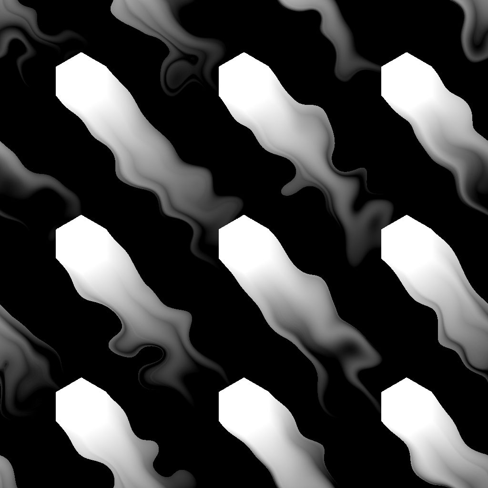

# 방향 거리

<table>
<tr style="border: 0;">
<td width="33.33%" style="border: 0;" valign="top">

{width="200px"}

<b>인:</b> 필터 > 효과

</td>
<td width="100.00%" style="border: 0;" valign="top">

## 설명

마스크의 테두리에서 지정된 방향의 거리 그레이디언트를 그립니다.

겹쳐진 그레이디언트는 가장 가까운 경계까지의 거리가 그려지도록 반전된 정규화된 거리로 정렬됩니다.

거리 맵을 사용하여 테두리를 따라 그레이디언트의 거리를 동적으로 조정할 수 있습니다.

</td>
</tr>
</table>

>[!TIP]
>
> [베벨 매끄럽게](../../../../../../compositing-graphs/nodes-reference-for-com/node-library/filters/effects/bevel-smooth/bevel-smooth.md) 노드는 모든 방향으로 확장이 수행되는 유사한 기능을 제공합니다.

<table>
<tr style="border: 0;">
<td style="border: 0;" valign="top">

</td>
<td style="border: 0;" valign="top">

### 출력 커넥터

</td>
<td style="border: 0;" valign="top">

### 매개변수

</td>
</tr>
</table>

## 입력 커넥터

|  |  |
| --- | --- |
| <b>입력</b> *회색 음영* 기본 | 마스크를 추출해야 하는 이미지입니다.   해당 마스크에서 0.5보다 큰 값은 모두 흰색입니다. |
| <b>거리 맵</b> *회색 음영* | &#39;거리 맵 승수&#39; 매개 변수 값이 0보다 높을 때 사용되는 선택적 입력입니다.   마스크의 테두리를 따라 경사/확장 거리를 조정하는 데 사용되며, 여기서 값이 더 어두우면 거리가 더 짧아집니다. |
| <b>각도 맵</b> *회색 음영* | &#39;Angle Map Multiplier&#39; 매개 변수 값이 0보다 높을 때 사용되는 선택적 입력입니다.   방향 각도에 해당 값을 추가하여 회전 수로 거리 그레이디언트의 방향을 조정하는 데 사용됩니다.   &#39;각도 맵 오프셋&#39; 매개 변수를 사용하면 0이라는 값을 지정하여 값을 다시 매핑할 수 있습니다. |

## 출력 커넥터

|  |  |
| --- | --- |
| <b>출력</b> *회색 음영* | 선택한 &#39;출력 모드&#39;에 따른 결과 이미지 |
| <b>UV</b> *색상* | UV가 지정된 방향을 따라 마스크 테두리에서 확장된 UV 맵   이렇게 확장된 UV를 사용하여 다른 이미지를 매핑하도록 [UV 매퍼](../../../../../../compositing-graphs/nodes-reference-for-com/node-library/spline-paths-tools/spline-tools/uv-mapper-color/uv-mapper-color.md) 노드에 연결할 수 있습니다. |

## 매개변수

|  |  |
| --- | --- |
| <b>출력 모드</b> *정수* | 마스크 테두리에서 거리 그레이디언트를 그리는 방법:<ul data-preserve-html="true"> <li data-preserve-html="true"><b>반전된 정규화된 거리:</b> 1부터 0까지의 그레이디언트입니다. 여기서 0은 &#39;최대 거리&#39;에 도달하고 연결된 경우 &#39;거리 맵&#39;을 곱한 값입니다</li> <li data-preserve-html="true"><b>거리:</b> 마스크 테두리에서 원시 거리 값의 그래디언트입니다. 여기서 1은 입력 이미지의 짧은 쪽 길이입니다</li> </ul> |
| <b>최대 거리</b> *부동* | 1이 입력 이미지의 짧은 변의 길이인 정규화된 이미지 공간에서 거리 구배에 의해 이동한 거리이다. |
| <b>각도</b> *부동* | 회전 수에 따른 거리 그레이디언트의 방향입니다. 여기서 0은 수평이고 오른쪽입니다(예: (1,0) 벡터). |
| <b>거리 맵 승수</b> *부동* | &#39;최대 거리&#39;에 대한 &#39;거리 맵&#39;의 영향을 조정합니다.   참고: &#39;거리 맵&#39; 입력이 연결되어 있지 않으면 이 매개 변수는 영향을 주지 않습니다. |
| <b>각도 맵 멀티플라이어</b> *부동* | &#39;각도&#39;에 대한 &#39;각도 맵&#39;의 영향을 조정합니다. |
| <b>각도 맵 오프셋</b> *부동* | 해당 맵에서 0이어야 하는 값을 지정하여 &#39;각도 맵&#39;의 값을 다시 매핑합니다.   예를 들어, 0.5의 오프셋은 0.75의 값이 0.25턴이고, 0.3의 값이 -0.2턴임을 의미한다. |

## 예

<table>
<tr style="border: 0;">
<td style="border: 0;" valign="top">

<table>
  <tr>
    <td>
      
       <i>이전</i>
    </td>
    <td>
      
       <i>이후</i>
    </td>
  </tr>
</table>

</td>
<td style="border: 0;" valign="top">

<table>
  <tr>
    <td>
      
       <i>이전</i>
    </td>
    <td>
      
       <i>이후</i>
    </td>
  </tr>
</table>

</td>
</tr>
</table>

<table>
<tr style="border: 0;">
<td style="border: 0;" valign="top">

<table>
  <tr>
    <td>
      
       <i>이전</i>
    </td>
    <td>
      
       <i>이후</i>
    </td>
  </tr>
</table>

</td>
<td style="border: 0;" valign="top">

<table>
  <tr>
    <td>
      
       <i>이전</i>
    </td>
    <td>
      
       <i>이후</i>
    </td>
  </tr>
</table>

</td>
</tr>
</table>

<table>
  <tr>
    <td>
      
       <i>이전</i>
    </td>
    <td>
      
       <i>이후</i>
    </td>
  </tr>
</table>
