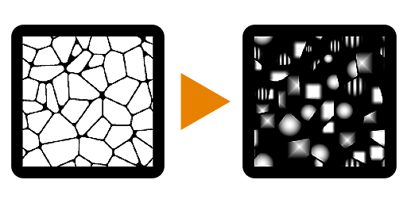

# Flood Fill 매퍼

<table>
<tr style="border: 0;">
<td style="border: 0;" valign="top">

## Flood Fill 매퍼(회색 음영)

**내부:** *필터/효과*

**복합**

</td>
<td style="border: 0;" valign="top">

## 설명

[Flood Fill 매퍼]를 사용하면 기존 [패턴] 또는 [텍스처]를 [Flood Fill](../../../../../../compositing-graphs/nodes-reference-for-com/node-library/filters/effects/flood-fill/flood-fill.md)의 모든 단일 셀에 다시 매핑할 수 있습니다. 단색이나 값을 생성하지 않지만 사용자 고유의 입력 맵을 사용할 수 있다는 점에서 [무작위 회색 음영](../../../../../../compositing-graphs/nodes-reference-for-com/node-library/filters/effects/flood-fill-random-gra/flood-fill-to-random-grayscale.md) 또는 [그레이디언트](../../../../../../compositing-graphs/nodes-reference-for-com/node-library/filters/effects/flood-fill-to-gradient/flood-fill-to-gradient.md)와 같은 다른 Flood Fill 변환과는 다릅니다. [Flood Fill](../../../../../../compositing-graphs/nodes-reference-for-com/node-library/filters/effects/flood-fill/flood-fill.md)과 [타일 Sampler](../../../../../../compositing-graphs/nodes-reference-for-com/node-library/texture-generators/patterns/tile-sampler/tile-sampler.md) 또는 [모양 매퍼](../../../../../../compositing-graphs/nodes-reference-for-com/node-library/texture-generators/patterns/shape-mapper/shape-mapper.md)를 조합한 것으로 볼 수 있습니다. 유사한 컨트롤과 인터페이스를 몇 가지 제공합니다.

색상 버전에는 표준 맵에서 작업할 수 있는 추가 컨트롤이 있으며, 여기서 [접선 공간 표준 맵 회전을 보정](../../../../../../compositing-graphs/nodes-reference-for-com/node-library/filters/normal-map/normal-vector-rotation/normal-vector-rotation.md)할 수 있습니다.

## 매개변수

### 입력

* **Flood Fill 상자**: *색상 입력*&#x200B;표준 Flood Fill 입력이 필요합니다.
* **패턴 입력 1-8**: *회색 음영/색상 입력*\
  사용자 정의 패턴 이미지 입력입니다.
* **패턴 분포 맵**: *회색 음영 입력* ID 맵으로 어떤 패턴이 어떤 셀에 가는지 결정합니다. 색인에 Flood Fill 등 다른 Flood Fill 맵에서 가져올 수 있습니다.
* **비율 맵**: *회색 음영 입력*&#x200B;셀당 비율을 결정하는 맵.
* **회전 맵**: *회색 음영 입력*&#x200B;셀당 회전을 결정하는 매핑.
* **광도 오프셋 맵**: *회색 음영 입력*&#x200B;셀당 광도 설정을 위한 맵

### 매개변수

* **타일링 모드**: *타일링 없음, H+V*&#x200B;타일링 사용 여부를 설정합니다. [크기] 또는 [비율]이 1 미만으로 설정된 경우에만 표시됩니다.
* **패턴**
  * **패턴 입력 번호**: *1 - 8*&#x200B;사용할 사용자 지정 패턴 입력의 양을 설정합니다.
  * **패턴 분포 모드**: *무작위, 모양 크기, 분포 맵 입력*&#x200B;셀에 표시되는 패턴을 결정하는 메서드를 설정합니다.
  * **패턴 분포 지터링**: *0.0 - 1.0*&#x200B;임의 시드를 통해 모든 것을 변경하지 않고 패턴 분포에서 약간의 변경이나 오프셋을 허용합니다.
* **크기**
  * **크기 모드**: *텍스처를 기준으로, 모양 기준선을 기준으로, 가장 큰 모양을 기준으로, 가장 작은 모양을 기준으로, 모양 상자에 맞춥니다*&#x200B;각 셀의 패턴 크기를 결정하는 방법을 설정합니다.
  * **크기**: *0.0 - 1.0*&#x200B;패턴의 균일하지 않은 비율을 허용합니다.
  * **비율**: *0.0 - 1.0*\
    효과의 전체(균일) 배율을 설정합니다.
  * **비율 맵 배율기**: *0.0 - 1.0*&#x200B;선택적 비율 맵의 영향을 설정합니다.
  * **무작위 크기 조절**: *-1.0 - 1.0*&#x200B;패턴 크기 조절 내에서 무작위 변이의 양을 설정합니다.
* **회전**
  * **회전**: *0.0 - 1.0*&#x200B;모든 셀에 대해 전체적으로 균일한 회전을 설정합니다.
  * **회전 맵 승산기**: *0.0 - 1.0*&#x200B;선택적 회전 맵의 영향을 설정합니다.
  * **임의 회전**: *0.0 - 1.0*&#x200B;모든 셀에 대한 임의 회전 양을 설정합니다.
  * **회전 자동 크기 조정**: *False/True*&#x200B;패턴을 회전할 때 셀에 맞게 크기를 조정할지 여부를 설정합니다.
* **위치**
  * **위치 오프셋**: *0.0 - 1.0*&#x200B;모든 셀에 대한 전역 위치 오프셋을 설정합니다.
  * **위치 오프셋 정렬**: *텍스처, 패턴*&#x200B;오프셋 0점을 패턴 셀 또는 텍스처에 정렬하도록 설정합니다.
  * **위치 오프셋 무작위**: *0.0 - 1.0*&#x200B;셀별 위치 오프셋 임의화 양을 설정합니다.
* **색상**(회색 음영 버전만)
  * **광도 범위**: *0.0 - 1.0*&#x200B;텍스처의 전체 대비를 설정합니다. 여기서 0은 중간 회색이 됩니다.
  * **광도 범위 임의**: *0.0 - 1.0*&#x200B;광도 범위에 대한 임의 지정 양을 설정합니다.
  * **광도 오프셋**: *-1.0 - 1.0*&#x200B;명도 컨트롤 역할을 하는 광도의 오프셋을 설정합니다.
  * **광도 오프셋 무작위**: *0.0 - 1.0*&#x200B;광도 오프셋에 대한 임의화의 양을 설정합니다.
  * **광도 오프셋 맵 배율기**: *0.0 - 1.0*&#x200B;선택적 광도 오프셋 맵의 영향을 설정합니다.
  * **배경색**: *(회색 음영 값)*텍스처가 혼합되는 배경색을 설정합니다.
* **색상**(색상 버전만)
  * **표준 맵**: *False/True*&#x200B;패턴 입력을 표준 맵으로 해석하도록 설정합니다. 수직 탄젠트 공간 회전을 보정하고 수정합니다.
  * **표준 형식**: *DirectX, OpenGL*\
    다른 표준 맵 포맷 간을 전환합니다(녹색 채널을 반전합니다). 표준 맵이 True인 경우에만 활성화됩니다.
  * **HSL 조정**: *-1.0 - 1.0* HSL을 전역적으로 조정합니다.
  * **HSL 임의**: *-1.0 - 1.0*&#x200B;셀당 HSL 임의 지정을 설정합니다.
  * **Alpha 조정**: *-1.0 - 1.0*&#x200B;전역 Alpha 조정을 설정하여 Alpha 대비를 줄입니다.
  * **Alpha 무작위**: *-1.0 - 1.0*&#x200B;셀당 Alpha 조정 무작위 지정을 설정합니다.
  * **배경색**: *(색상 값)*텍스처가 혼합되는 배경색을 설정합니다.

.

## 예제 이미지

</td>
</tr>
</table>
