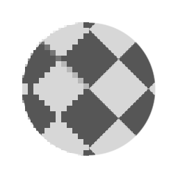

# FXAA

<table>
<tr style="border: 0;">
<td width="33.33%" style="border: 0;" valign="top">

<b>인:</b> 필터 > 효과

</td>
<td width="100.00%" style="border: 0;" valign="top">

## 설명

FXAA 알고리즘에 따라 앤티 앨리어스 필터를 적용합니다. 이를 사용하여 모양의 톱날 모양, 픽셀화된 가장자리를 수정할 수 있습니다. 이 기능은 앤티 앨리어스 가장자리에 대한 간단한 노드 솔루션을 제공하므로 가장자리가 픽셀화된 [디스크 모양](../../../../../../compositing-graphs/nodes-reference-for-com/node-library/texture-generators/patterns/shape/shape.md)과 같은 작업에 특히 유용합니다.

</td>
</tr>
</table>

## 예

<table style="margin-top: 32px; margin-bottom: 32px">
    <tr style="border: 0">
        <td style="border: 0; background: transparent">
            
        </td>
    </tr>
</table>
