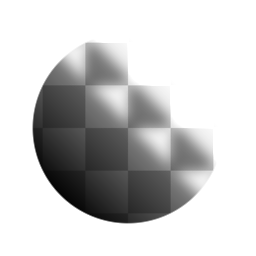

# 광선

<table>
<tr style="border: 0;">
<td width="33.33%" style="border: 0;" valign="top">

{width="128px"}

{width="128px"}

<b>인:</b> 필터 > 효과

</td>
<td width="100.00%" style="border: 0;" valign="top">

## 설명

다른 인기 있는 이미지 편집 소프트웨어에서 볼 수 있는 &quot;외부 광선&quot; 유형의 효과를 수행합니다. 기본적으로 입력 주위에 페이딩 그레이디언트 윤곽선을 추가합니다.

예상과 달리 알파 채널이 있는 이미지에는 적용되지 않습니다. 색상 버전에서도 이진, 검은색 및 흰색 마스크만 입력으로 표시되며 색상이 있는 광선만 사용할 수 있습니다. 투명도가 있는 이미지에 사용할 버전을 찾고 있는 경우 [모양 광선](../../../../../../compositing-graphs/nodes-reference-for-com/node-library/filters/effects/shape-glow/shape-glow.md)을 참조하세요.

중요: 입력에 적합한 버전을 사용해야 합니다. 색상 입력에는 &quot;Glow&quot;를 사용하고 회색 음영 입력에는 &quot;Glow Grayscale&quot;을 사용합니다.

</td>
</tr>
</table>

## 매개변수

|  |  |
|:---|:---|
| <b>광선 양</b> <i>0.0 - 1.0</i> | 광선 효과에 대한 전체 불투명도입니다. |
| <b>양 지우기</b> <i>0.0 - 1.0</i> | 광선 효과를 잘라내야 하는 시점을 나타내는 트롤홀드입니다. 반투명 영역에 유용합니다. |
| <b>광선 크기</b> <i>0.0 - 20.0</i> | 광선 효과의 도달 범위를 제어합니다. |
| <b>광선 색상</b> <i>(색상 값)(색상 버전만)</i> | 광선 효과의 색상을 설정합니다. |

## 예

<table style="margin-top: 32px; margin-bottom: 32px">
    <tr style="border: 0">
        <td style="border: 0; background: transparent">
            
        </td>
    </tr>
</table>
