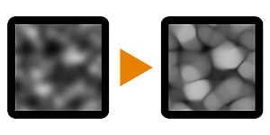

# 모자이크

<table>
<tr style="border: 0;">
<td style="border: 0;" valign="top">

{width="128px"}

{width="128px"}

## 모자이크(회색 음영)

**내부:** *필터/효과*

**중간**

</td>
<td style="border: 0;" valign="top">

## 설명

멀티패스 [뒤틀기](../../../../../../compositing-graphs/nodes-reference-for-com/atomic-nodes/warp/warp.md) 효과를 수행하여 기존의 매끄럽고 경사진 그레이디언트 맵을 &quot;페이스티스&quot;합니다. 두 입력에 동일한 맵을 사용하면 기본적으로 가장 밝은 영역이 커지고 강조됩니다.

이 기능은 모양에 더 많은 정의를 적용할 수 있으므로 Heightmap과 같은 회색 음영 맵에 더 많은 정의를 추가하는 데 유용합니다.

## 매개변수

### 입력

* **색상**: *색상/회색 음영 입력*
* **모자이크 맵**: *회색 음영 입력*\
  드라이버 맵을 뒤틀었습니다. 첫 번째 입력과 같을 수 있습니다.

### 매개변수

* **샘플**: *0 - 16*&#x200B;다중 샘플 품질을 결정합니다.
* **강도**: *0.0 - 1.0*&#x200B;효과의 강도.

## 예제 이미지

| 

 |
| --- |
|  |

</td>
</tr>
</table>
