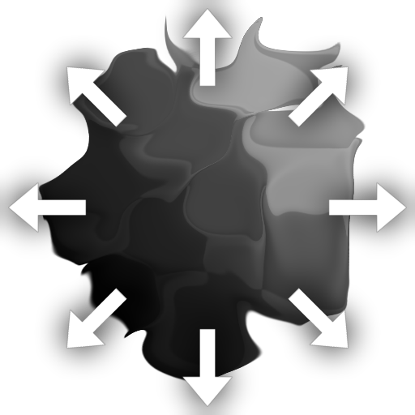

# 다중 방향 뒤틀기

<table>
<tr style="border: 0;">
<td width="33.33%" style="border: 0;" valign="top">

<b>인:</b> 필터 > 효과

</td>
<td width="100.00%" style="border: 0;" valign="top">

## 설명

배치된 방향성 뒤틀기가 제자리에 있는 동안 다중 텍스처가 반대 방향으로 [방향성 뒤틀기](../../../../../../compositing-graphs/nodes-reference-for-com/atomic-nodes/directional-warp/directional-warp.md)을(를) 여러 번 적용합니다. 원자형이 하나만 허용하는데 비해 여러 방향으로 밀어낼 수 있다는 점에서 표준 방향성 뒤틀기와 차이가 있다. 이 방식은 방향성 뒤틀기가 항상 단일 방향으로 이미지를 너무 멀리 밀어내는 것처럼 보이는, 단일 방향 대신 여러 방향 또는 축을 따라 작동하는 것처럼 보이는 기존 문제를 해결합니다.

[Non Uniform Directional Warp](../../../../../../compositing-graphs/nodes-reference-for-com/node-library/filters/effects/non-uniform-directional/non-uniform-directional-warp.md)과(와) 주로 다릅니다. 뒤틀기 방향은 매개 변수를 통해서만 제어되며 입력 맵을 통해 설정할 수 없습니다. 장점은 사용이 약간 쉬우며 사용 상황에 따라 더 정밀할 수 있다는 점이다.

</td>
</tr>
</table>

## 입력

|  |  |
|:---|:---|
| <b>입력</b> <i>회색 음영/색상 입력</i> | 뒤틀기가 적용될 기본 맵입니다. 색상이나 회색 음영일 수 있습니다. |
| <b>강도 입력</b> <i>회색 음영 입력</i> | 뒤틀기 효과의 강도를 제어하는 필수 마스크 맵은 회색 음영이어야 합니다. |

## 매개변수

|  |  |
|:---|:---|
| <b>강도</b> <i>0.0 - 20.0</i> | 뒤틀기 효과의 강도 및 픽셀을 얼마나 멀리 밀지 설정합니다. |
| <b>뒤틀기 각도</b> <i>0.0 - 1.0</i> | [뒤틀기] 효과를 적용할 각도나 방향을 설정합니다. |
| <b>모드</b> <i>평균, 최대, 최소, 체인</i> | 연속 패스의 혼합 모드를 설정합니다. 방향이 2 또는 4인 경우에만 효과가 있습니다! |
| <b>방향</b> <i>1, 2, 4</i> | 뒤틀기의 작동 축 수를 설정합니다. 1은 각도 방향으로 이동함을 의미하며, 그 반대 방향인 2는 각도 축 + 수직 축, 4는 이전 축 + 45도 기울기를 의미합니다. |
