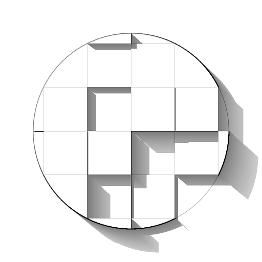

# RT 그림자

<table>
<tr style="border: 0;">
<td width="41.60%" style="border: 0;" valign="top">

<b>내부:</b> *필터/효과*

</td>
<td width="58.30%" style="border: 0;" valign="top">

## 설명

Height 맵 입력에서 광선 추적형 그림자를 생성합니다.

이 노드는 계산 시간으로 인해 CPU(SSE) 엔진과 함께 사용하면 안 됩니다.

</td>
</tr>
</table>

## 매개변수

<b>샘플</b> *정수*\
그림자를 계산하는 데 사용되는 광선 수입니다.\
값이 높을수록 성능이 저하되는 대신 더 부드럽고 정확한 결과를 얻을 수 있습니다.

<b>모드</b> *정수*\
표면에 그림자를 그리는 방법입니다.

<b>Height 크기</b> *부동*\
입력 Height 맵의 강도에 대한 승수입니다.

<b>조명 위치 </b>*부동 소수점2*\
서피스를 둘러싸는 구의 광원 위치:
* <b>X</b>: 가로 위치, 회전 수;
* <b>Y</b>: 세로 위치. 여기서 0.5는 정점이고 0/1은 수평선입니다.

<b>조명 강도</b> *부동*\
광원의 강도입니다.

<b>조명 크기</b> *Float2*(<b>모드</b>가 *음영*(으)로 설정된 경우 사용 가능)\
광원의 사각형 크기입니다.

<b>조명 비율(부드러운 그림자)</b> *부동*\
광선 방향에 대한 <b>조명 크기</b>의 기여도에 대한 승수입니다.\
값이 높을수록 어두운 영역이 더 매끄럽게 표시됩니다.

<b>수평선 위에 빛 유지</b> *부울*\
수평선 아래에 조명을 배치하는 방식으로 <b>조명 위치</b>를 설정하면 이 매개 변수는 조명이 해당 임계값을 넘지 않도록 합니다. 즉, Y 값이 [0;1] 범위로 고정되어 있습니다.

<b>그림자 불투명도</b> *부동*\
표면에 그려진 그림자의 불투명도에 대한 승수입니다.

<b>그림자 감쇠</b> *부동*\
그림자가 캐스터와 멀리 떨어질수록 그림자의 감쇠에 대한 승수이다.\
값을 0으로 설정하면 그림자가 균일하게 표시됩니다(부드러운 그림자는 계속 적용됨).

<b>최대 그림자 길이</b> *부동*\
캐스터에서 그림자를 그릴 수 있는 최대 거리입니다.\
값을 0으로 설정하면 그림자가 표시되지 않습니다.

## 예제 이미지

<table>
<tr style="border: 0;">
<td style="border: 0;" valign="top">

</td>
<td style="border: 0;" valign="top">

</td>
<td style="border: 0;" valign="top">

</td>
</tr>
</table>
