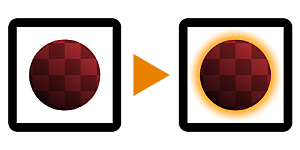

# Shape Glow

<table>
<tr style="border: 0;">
<td width="33.33%" style="border: 0;" valign="top">

{width="128px"}

{width="128px"}

<b>인:</b> 필터 > 효과

</td>
<td width="100.00%" style="border: 0;" valign="top">

## 설명

입력 마스크(회색 음영 버전) 또는 알파 채널이 있는 모양(색상 버전) 주위에 부드러운 광선을 만듭니다. [광선](../../../../../../compositing-graphs/nodes-reference-for-com/node-library/filters/effects/glow/glow.md)과 비교하여 이 기능은 더 많은 컨트롤을 사용하여 더 완벽한 효과이므로 다른 2D 이미지 편집 소프트웨어와 더 유사한 방식으로 작동합니다.

</td>
</tr>
</table>

## 매개변수

|  |  |
|:---|:---|
| <b>모드</b> <i>소프트, 정밀</i> | 두 정확도 모드 사이를 전환합니다. |
| <b>너비</b> <i>-1.0 - 1.0</i> | 광선의 도달 범위를 제어합니다. |
| <b>스프레드</b> <i>0.0 - 1.0</i> | 흐림 효과를 위한 잘라내기/축소판 기능을 사용하면 광선이 모양에 가깝게 입체감 있게 보입니다. |
| <b>불투명도</b> <i>0.0 - 1.0</i> | 광선 효과에 대한 혼합 불투명도. |
| <b>(그림자) 색상</b> <i>(색상 값)</i> | 광선에 적용할 색상 색조입니다. |
| <b>마스크 색상</b> <i>(색상 값)(회색 음영 버전만)</i> | 투명도 매핑 출력에 사용되는 단색입니다. |
| <b>미리 곱하기</b> <i>False/True(색상 버전만)</i> | 입력을 미리 곱하기로 가정해야 하는지 여부입니다. |
| <b>미리 곱하기 출력</b> <i>거짓/참</i> | 출력을 미리 곱해야 하는지 여부입니다. |

## 예

<table style="margin-top: 32px; margin-bottom: 32px">
    <tr style="border: 0">
        <td style="border: 0; background: transparent">
            
        </td>
    </tr>
</table>
