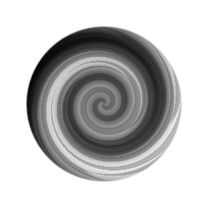

# 소용돌이

<table>
<tr style="border: 0;">
<td style="border: 0;" valign="top">

## 소용돌이(회색 음영)

**내부:** *필터/효과*

**단순**

</td>
<td style="border: 0;" valign="top">

## 설명

이렇게 하면 입력 이미지를 소용돌이 방향으로 뒤틀어 변형합니다. 소용돌이를 캔버스의 일부로 이동할 수 있는 추가 컨트롤이 있습니다.

## 매개변수

* **행렬**\
  소용돌이 효과를 수동으로 옮길 수 있습니다. 2D 미리 보기에서 핸들과 상호 작용하여 수정할 수도 있습니다.
  * **행렬**: *(변환 행렬)*
  * **오프셋**: *0.0 - 1.0*
* **양**: *-16.0 - 16.0*&#x200B;소용돌이 효과의 강도.

## 예제 이미지

</td>
</tr>
</table>
