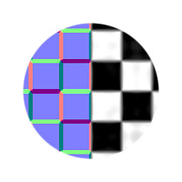

# Height에 표준

<table>
<tr style="border: 0;">
<td width="33.33%" style="border: 0;" valign="top">

{width="128px"}

<b>내부:</b> 필터 > 노멀 맵

</td>
<td width="100.00%" style="border: 0;" valign="top">

## 설명

탄젠트 공간 정규맵을 다시 Heightmap으로 변환하려는 역방향 변환 노드입니다. 약간 더 단순한 버전입니다. [Height HQ에 표준](../../../../../../compositing-graphs/nodes-reference-for-com/node-library/filters/normal-map/normal-to-height-hq/normal-to-height-hq.md)에 더 많은 옵션이 있습니다.

Normalmap 소스만 있지만 Heightmap과 결합하는 작업을 수행하려는 경우에 유용합니다. Height이 [일반]으로 변환되는 프로세스의 특성상 정보가 손실되므로 이 경우 100% 정확한 결과를 제공할 수 없다는 점을 명심하십시오. 설정을 그에 맞게 조정하면 이 비 HQ 버전은 간단한 세부 사항을 변환하는 괜찮은 작업을 수행합니다.

</td>
</tr>
</table>

## 매개변수

|  |  |
|:---|:---|
| <b>부조 균형</b> <i>0.0 - 1.0</i> | 서로 다른 주파수가 최종 결과에 영향을 주는 정도를 조정합니다. 이는 대체로 투입 지도에 의존하며 약간의 수정이 필요하다. |
| <b>표준 형식</b> <i>DirectX, OpenGL</i> | 서로 다른 표준 맵 포맷 사이를 전환합니다(녹색 채널을 반전합니다). |
| <b>전체 불투명도</b> <i>0.0 - 1.0</i> | 효과의 전체 불투명도를 조정합니다. |

## 예

<table style="margin-top: 32px; margin-bottom: 32px">
    <tr style="border: 0">
        <td style="border: 0; background: transparent">
            
        </td>
    </tr>
</table>
