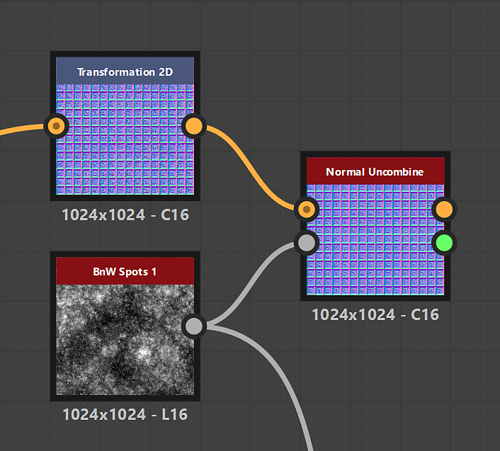

# 표준 결합 해제

<table>
<tr style="border: 0;">
<td width="33.33%" style="border: 0;" valign="top">

{width="200px"}

<b>내부:</b> 필터 > 표준 맵

</td>
<td width="100.00%" style="border: 0;" valign="top">

## 설명

표준 맵에서 Height 맵으로 설명하는 서피스 세부 정보를 제거합니다.

</td>
</tr>
</table>

## 입력

|  |  |
|:---|:---|
| <b>결합된 표준</b> 기본 <i>색상</i> | 세부 정보를 제거해야 하는 일반 맵입니다. |
| <b>Height</b> <i>회색 음영</i> | Height 맵은 결합된 표준 맵에서 제거해야 할 표면 세부 정보를 나타냅니다. |

## 출력

|  |  |
|:---|:---|
| <b>결합되지 않은 정상</b> <i>색상</i> | 입력 Height 맵에 의해 기술된 표면 세부 정보가 제거된 표준 맵. |
| <b>추정 강도</b> <i>부동</i> | 입력 표준 맵의 강도와 일치하도록 입력 Height 맵에 연결된 [표준](../../../../../../compositing-graphs/nodes-reference-for-com/atomic-nodes/normal/normal.md) 노드로 설정되어야 하는 강도의 추정치입니다. |

## 매개변수

|  |  |
|:---|:---|
| <b>일반 형식</b> *정수* | 입력 표준 맵의 형식입니다. 녹색 채널을 효과적으로 반전합니다.<ul data-preserve-html="true"> <li data-preserve-html="true"><b>DirectX:</b> Y축이 위쪽을 가리킵니다.</li> <li data-preserve-html="true"><b>OpenGL:</b> Y축은 아래를 가리킵니다.</li> </ul> |

## 예

<table>
  <tr>
    <td>
      
       <i>이전</i>
    </td>
    <td>
      
       <i>이후</i>
    </td>
  </tr>
</table>

{zoomable="yes"}

<table>
  <tr>
    <td>
      
       <i>이전</i>
    </td>
    <td>
      
       <i>이후</i>
    </td>
  </tr>
</table>

{zoomable="yes"}

<table>
  <tr>
    <td>
      
       <i>이전</i>
    </td>
    <td>
      
       <i>이후</i>
    </td>
  </tr>
</table>

{zoomable="yes"}
