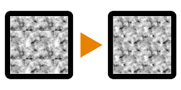

# 사진을 바둑판식으로 만들기

<table>
<tr style="border: 0;">
<td width="33.33%" style="border: 0;" valign="top">

<b>내부:</b> 필터 > 타일링

</td>
<td width="100.00%" style="border: 0;" valign="top">

## 설명

이 노드는 비연속적인 가장자리로 인해 바둑판식으로 배열되지 않을 수 있는 이미지에 대한 가장자리 수정 기능을 제공합니다. 입력 이미지의 가장자리를 제외한 다른 요소에는 영향을 주지 않습니다. 비율 또는 타일을 다른 방법으로 조정하려면 [바둑판식 패치로 만들기](../../../../../../compositing-graphs/nodes-reference-for-com/node-library/filters/tiling/make-it-tile-patch/make-it-tile-patch.md)를 확인하세요.

</td>
</tr>
</table>

## 매개변수

|  |  |
|:---|:---|
| <b>마스크 뒤틀기 H</b> <i>-100.0 - 100.0</i> | 정의되지 않은 전환을 피하기 위해 가로 축에 뒤틀기를 도입합니다. |
| <b>마스크 뒤틀기 V</b> <i>-100.0 - 100.0</i> | 정의되지 않은 전환을 피하기 위해 세로 축에 뒤틀기를 도입합니다. |
| <b>마스크 크기 H</b> <i>0.0 - 1.0</i> | 전환 가장자리가 가로로 도달하는 거리를 설정합니다. |
| <b>마스크 크기 V</b> <i>0.0 - 1.0</i> | 전환 가장자리가 세로로 닿는 거리를 설정합니다. |
| <b>마스크 정밀도 H</b> <i>0.0 - 1.0</i> | 전환이 가로로 얼마나 매끄러운지 설정합니다. |
| <b>마스크 정밀도 V</b> <i>0.0 - 1.0</i> | 전환이 세로로 얼마나 매끄러운지 설정합니다. |

## 예

<table style="margin-top: 32px; margin-bottom: 32px">
    <tr style="border: 0">
        <td style="border: 0; background: transparent">
            
        </td>
    </tr>
</table>
