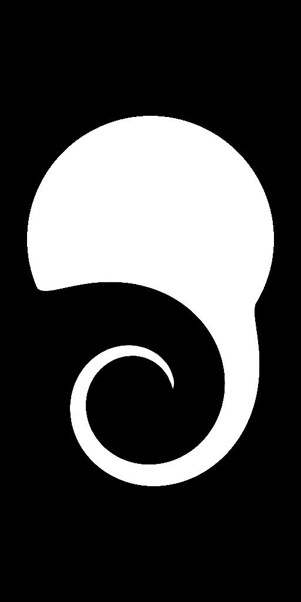

# 자동 자르기

<table>
<tr style="border: 0;">
<td width="41.60%" style="border: 0;" valign="top">

<table>
<tr style="border: 0;">
<td style="border: 0;" valign="top">

{width="200px"}

</td>
<td style="border: 0;" valign="top">

{width="200px"}

</td>
</tr>
</table>

**내부:** 필터*/변환*

**단순**

</td>
<td width="58.30%" style="border: 0;" valign="top">

## 설명

**자동 자르기** 노드는 **입력**&#x200B;을 조정하여 해당 콘텐츠가 크기 조정 없이 이미지의 *중앙*&#x200B;에 배치되거나 이미지의 범위&#x200B;*에 맞게*&#x200B;크기 조정됩니다.

이미지의 내용은 **X** 및 **Y**&#x200B;의 *첫 번째 및 마지막 픽셀*&#x200B;에 맞는 상자로 정의되며, 값은 *0*&#x200B;보다 높습니다(예: 검은색이 아님). **색상** 버전에서는 해당 상자를 정의하기 위한 RGB 및 Alpha 채널을 선택할 수 있습니다.

</td>
</tr>
</table>

## 매개변수

* **모드** *정수*&#x200B;적용할 자르기 메서드를 설정합니다.
  * *정사각형 자르기*: 이미지가 잘려서 가장 작은 *정사각형* 이미지 중앙에 모양이 완전히 포함될 수 있습니다.
  * *자동 자르기*: 이미지가 잘려서 가장 작은 *정사각형 또는 정사각형이 아닌* 이미지 중앙에 모양이 완전히 포함될 수 있습니다
  * *맞춤(비율 유지)*: 이미지의 *비율*(예: 너비 대 길이 비율)을 유지하면서 이미지의 *전체 범위*&#x200B;에 맞게 이미지 크기가 조정됩니다.
  * *채우기(스트레치)*: 이미지 크기가 이미지의 *전체 범위*(으)로 조정되었습니다.
* **알파 사용** *부울&#x200B;***입력**&#x200B;의 알파 채널을 사용하여 자르기를 위한 이미지 콘텐츠의 *경계*&#x200B;를 결정합니다. *False*(으)로 설정하면 검정색 픽셀이 대신 사용됩니다.\
  *참고*: 이 매개 변수는 노드의 **Color** 버전에서만 사용할 수 있습니다.
* **필터링 모드** *정수*&#x200B;픽셀 간에 *보간*&#x200B;할 때 샘플링된 결과를 처리하는 방법을 정의합니다.
  * *가장 가까운*: 정확히 *같은* 값을 샘플링합니다(더 빠름).
  * *쌍선형*: *더 매끄럽게* 모양을 위해 결과에 쌍선형 필터를 적용합니다.
  * *자동*: 자르기에 선택한 **모드**&#x200B;에 따라 위의 두 가지 모드 중 가장 적절한 모드를 사용합니다

## 예제 이미지

<table>
<tr style="border: 0;">
<td style="border: 0;" valign="top">

{width="768px"}

</td>
<td style="border: 0;" valign="top">

{width="256px"}

</td>
<td style="border: 0;" valign="top">

{width="128px"}

</td>
<td style="border: 0;" valign="top">

{width="256px"}

</td>
<td style="border: 0;" valign="top">

{width="256px"}

</td>
<td style="border: 0;" valign="top">

{width="420px"}

</td>
</tr>
</table>
