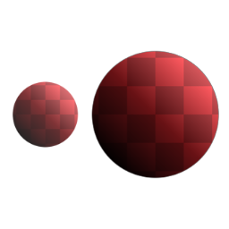
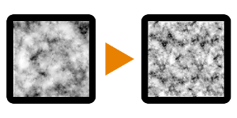

# 노이즈 확대 1

<table>
<tr style="border: 0;">
<td width="33.33%" style="border: 0;" valign="top">

{width="128px"}

<b>필터</b>:

</td>
<td width="100.00%" style="border: 0;" valign="top">

## 설명

입력 노이즈를 절차적으로 가져와 최대 2배의 해상도로 크기를 조절하며, 세부 사항은 유지하지만 너무 많은 타일링을 가져오지 않습니다. &quot;X&quot; 유형의 마스크를 사용하고 원본 입력과 유사한 대비를 사용하여 혼합합니다(내부 혼합 모드는 복사).

이 노드는 대부분 크고 무거운 노이즈를 사용하는 느린 그래프를 최적화하기 위한 것입니다. 이를 통해 너무 많은 추가 컴퓨팅 시간을 도입하지 않고도 더 높은 해상도를 사용할 수 있습니다.

이 프로세스의 다양한 변형을 보려면 [노이즈 업스케일 2](../../../../../../compositing-graphs/nodes-reference-for-com/node-library/filters/transforms/noise-upscale-2/noise-upscale-2.md) 및 [노이즈 업스케일 3](../../../../../../compositing-graphs/nodes-reference-for-com/node-library/filters/transforms/noise-upscale-3/noise-upscale-3.md)도 참조하세요.

</td>
</tr>
</table>

## 매개변수

|  |  |
|:---|:---|
| <b>오프셋1X</b> <i>0.0 - 1.0</i> | X축을 기준으로 위쪽과 아래쪽을 슬라이드합니다. |
| <b>오프셋1Y</b> <i>0.0 - 1.0</i> | Y축을 기준으로 위쪽과 아래쪽을 슬라이드합니다. |
| <b>Offset2X</b> <i>0.0 - 1.0</i> | X축 위로 왼쪽 및 오른쪽 부분을 슬라이드합니다. |
| <b>Offset2Y</b> <i>0.0 - 1.0</i> | Y축 위로 왼쪽 및 오른쪽 부분을 슬라이드합니다. |

## 예

<table style="margin-top: 32px; margin-bottom: 32px">
    <tr style="border: 0">
        <td style="border: 0; background: transparent">
            
        </td>
    </tr>
</table>
