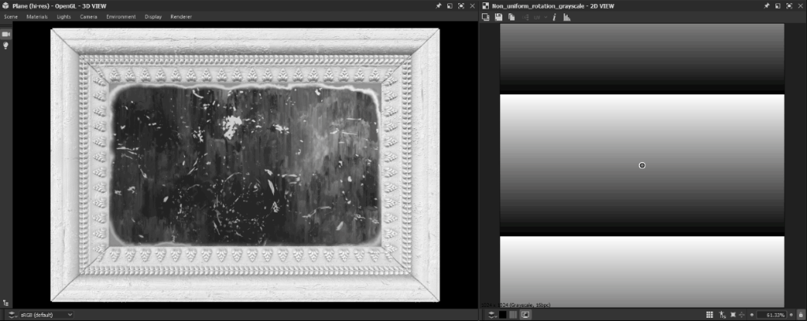

# 균일하지 않은 회전

<table>
<tr style="border: 0;">
<td width="33.33%" style="border: 0;" valign="top">

<table>
<tr style="border: 0;">
<td style="border: 0;" valign="top">

{width="200px"}

</td>
<td style="border: 0;" valign="top">

{width="200px"}

</td>
</tr>
</table>

<b>필터</b>:

</td>
<td width="100.00%" style="border: 0;" valign="top">

## 설명

**비균일 회전** 노드는 **회전 맵** 입력을 사용하여 **입력**&#x200B;을 회전합니다.

이미지의 값은 *회전 수*&#x200B;를 나타냅니다. 회전은 **피벗 위치** 값 또는 **피벗 위치 맵** 입력에 의해 지정된 위치를 중심으로 수행됩니다.\
**회전 맵** 입력에서 양수 값을 입력하면 *시계 방향* 회전이 발생합니다.

</td>
</tr>
</table>

## 입력

|  |  |
|:---|:---|
| <b>입력</b> <i>회색 음영/색상</i> | 회전해야 하는 입력 회색 음영 이미지. |
| <b>회전 맵</b> <i>회색 음영</i> | *회전 수*&#x200B;로 회전량을 제어하는 데 사용되는 맵입니다. 샘플링된 값은 **회전 각도 승수**&#x200B;에 대해 곱해집니다. 음수 값을 사용하면 *시계 반대 방향* 회전이 발생합니다. |
| <b>회전 피벗 위치 맵</b> <i>색상</i> | 회전 *피벗*&#x200B;의 위치를 지정하는 데 사용되는 이미지입니다. **X/Y** 위치가 이미지의 **R/G** 채널에 매핑됩니다. |

## 매개변수

|  |  |
|:---|:---|
| <b>회전 각도 배율</b> <i>부동</i> | **회전 맵** 입력의 강도를 조정합니다. |
| <b>회전 각도 오프셋</b> <i>부동</i> | 지정된 추가 회전 양을 적용합니다. |
| <b>피벗 위치 맵 사용</b> <i>부울</i> | *비트맵 입력*&#x200B;을 사용하여 회전 피벗의 위치를 지정하십시오. **X/Y** 위치가 **위치 맵** 입력의 **R/G** 채널에 매핑됩니다. |
| <b>피벗 위치</b> <i>Float2</i> | 이미지가 회전하는 피벗의 위치입니다. |
| <b>배경색</b> <i>Float/Float4</i> | 타일링이 **H 및 V 타일링**&#x200B;으로 설정되지 않은 경우 이미지 경계의 *외부*&#x200B;에 표시할 배경색입니다. |
| <b>필터링 모드</b> <i>정수</i> | *픽셀 간의   -*&#x200B;가장 가까운&#x200B;*: 정확히*&#x200B;같은&#x200B;*값을 샘플링할 때 -*&#x200B;쌍선형&#x200B;*:*&#x200B;더 매끄럽게&#x200B;*보이도록 결과에 쌍선형 필터를 적용할 때 샘플링된 결과를 처리하는 방법을 정의합니다.* |

## 예

<table style="margin-top: 32px; margin-bottom: 32px">
    <tr style="border: 0">
        <td style="border: 0; background: transparent">
            
        </td>
        <td style="border: 0; background: transparent">
            
        </td>
        <td style="border: 0; background: transparent">
            
        </td>
    </tr>
</table>
