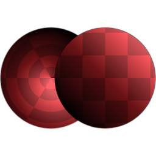

# 극지에서 데카르트어로

<table>
<tr style="border: 0;">
<td width="33.33%" style="border: 0;" valign="top">

{width="128px"}

{width="128px"}

<b>필터</b>:

</td>
<td width="100.00%" style="border: 0;" valign="top">

## 설명

극좌표(각도 및 반경)의 입력을 직교 좌표(X 및 Y)로 변환합니다. 그 반대는 [직각에서 극으로](../../../../../../compositing-graphs/nodes-reference-for-com/node-library/filters/transforms/cartesian-to-polar/cartesian-to-polar.md)로 가능합니다.

</td>
</tr>
</table>

## 예

<table style="margin-top: 32px; margin-bottom: 32px">
    <tr style="border: 0">
        <td style="border: 0; background: transparent">
            
        </td>
    </tr>
</table>
