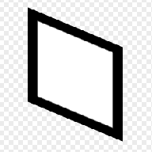

# 기울이기

<table>
<tr style="border: 0;">
<td width="33.33%" style="border: 0;" valign="top">

{width="128px"}

{width="128px"}

<b>필터</b>:

</td>
<td width="100.00%" style="border: 0;" valign="top">

## 설명

입력 이미지를 기울입니다.

</td>
</tr>
</table>

## 매개변수

|  |  |
|:---|:---|
| <b>축</b> <i>가로, 세로</i> | 을(를) 선택하여 세로 또는 가로로 기울입니다. |
| <b>금액</b> <i>-1.0 - 1.0</i> | 기울이기의 양입니다. |
| <b>맞춤</b> <i>중앙, 왼쪽 위, 오른쪽 아래</i> | [기울이기] 변형의 원점을 설정합니다. |

## 예

<table style="margin-top: 32px; margin-bottom: 32px">
    <tr style="border: 0">
        <td style="border: 0; background: transparent">
            
        </td>
    </tr>
</table>
