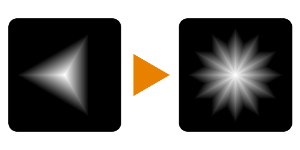

# 대칭

<table>
<tr style="border: 0;">
<td style="border: 0;" valign="top">

{width="128px"}

## 대칭

**내부:** *필터/변형*

**중간**

</td>
<td style="border: 0;" valign="top">

## 설명

입력 이미지에 대해 다양한 대칭 작업을 수행합니다. 기하학적 모양을 대칭적으로 만드는 데 사용할 수 있습니다.

이 노드는 [거울](../../../../../../compositing-graphs/nodes-reference-for-com/node-library/filters/transforms/mirror-filter-node/mirror-filter-node.md)과(와) 매우 비슷하지만 혼합 모드를 위한 추가 컨트롤이 있습니다.

## 매개변수

* **대칭 모드**: *대칭 모드: 대칭 Y, 거울 X, 대각선 왼쪽, 대각선 오른쪽, 거울 X/Y, 거울 X/거울 Y, 대각선 왼쪽/대각선 오른쪽, 대각선 오른쪽/대각선 왼쪽, 8*&#x200B;대칭 기하학적 모드를 선택합니다.
* **전송 모드**: *0 - 6*&#x200B;대칭 혼합 모드 선택: 복사, 추가, 빼기, 곱하기, 하위 추가, 최대, 최소.

## 예제 이미지

| 

 |
| --- |
|  |

</td>
</tr>
</table>
