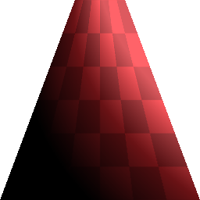
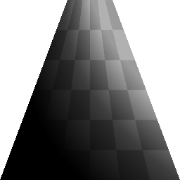

# 사다리꼴 변형

<table>
<tr style="border: 0;">
<td width="33.33%" style="border: 0;" valign="top">

{width="128px"}

{width="128px"}

<b>필터</b>:

</td>
<td width="100.00%" style="border: 0;" valign="top">

## 설명

원근감/사다리꼴 변형 방식으로 입력을 수정하는 특별한 노드 Top 및 Bottom에 대한 제어가있다. 더 강한 효과를 위해 값을 한도를 넘어 푸시할 수 있습니다.

</td>
</tr>
</table>

## 매개변수

|  |  |
|:---|:---|
| <b>상단 늘리다</b> <i>0.0 - 1.0</i> | 상단의 스쿼시(squash)의 양을 설정합니다. |
| <b>밑단(bottom)</b> <i>0.0 - 1.0</i> | 바닥에 깔거나 쪼는 양을 설정합니다. |
| <b>배경색</b> <i>(회색 음영/색상 값)</i> | 타일링이 꺼진 경우 단색 배경색을 설정합니다. |
| <b>샘플링</b> <i>쌍선형, 가장 가까운</i> | 샘플링 품질을 설정합니다. |

## 예

<table style="margin-top: 32px; margin-bottom: 32px">
    <tr style="border: 0">
        <td style="border: 0; background: transparent">
            
        </td>
    </tr>
</table>
